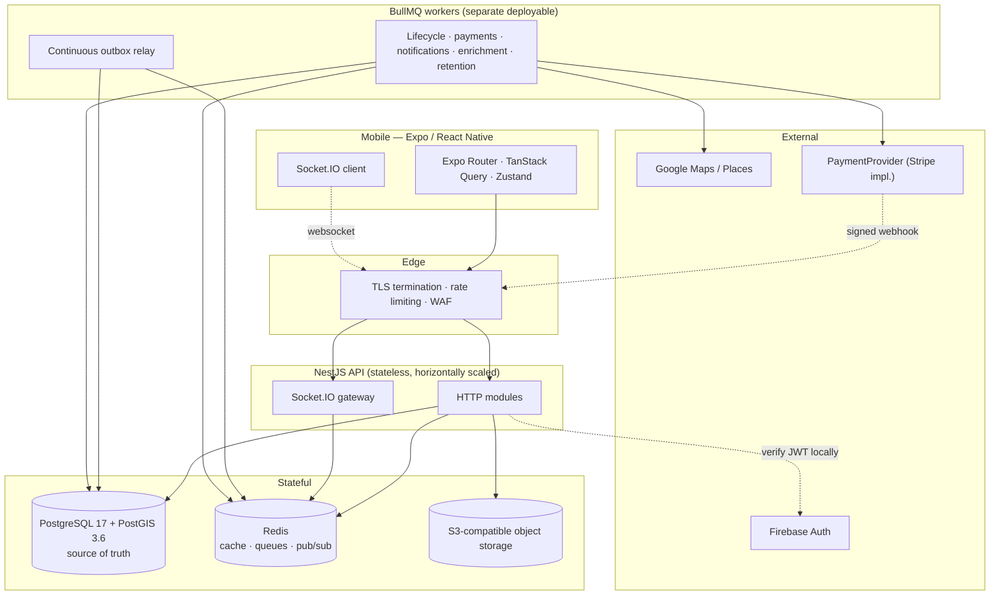
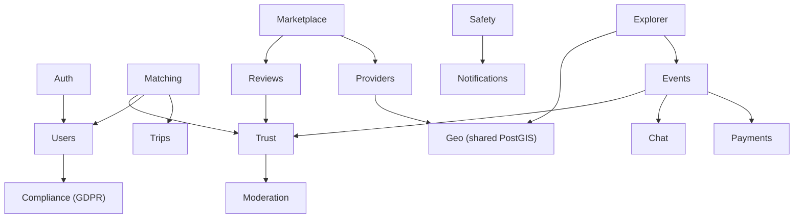

# TripWith — Phase 1 Architecture and Database + Phase 2/3/4 Addenda

**Date:** 2026-08-20 (revised through the Phase 4 post-review correction gate on 2026-08-21)
**Status:** Phases 1–4 implemented, corrected and verified; Phase 4 closed; Phase 5 not started
**Scope:** Architecture, complete relational model, initial migration, Phase 2 backend/infrastructure, Phase 3 Authentication & Users, and Phase 4 Trips & Matching. No frontend and no payment-provider business implementation.

---

## 1. Decisions and assumptions

| Decision | Choice | Consequence |
|---|---|---|
| Data layer | TypeORM + hand-written SQL migrations | Migrations are reviewable `.sql`; no generator mangles GIST/partial/generated constructs |
| Regulatory baseline | EU-first (GDPR + PSD2/SCA, EUR) | `user_consents` ledger; payments model an SCA challenge state; money is integer minor units + ISO-4217 |
| Minimum age | 18+ platform-wide | Trigger-enforced; age-preference columns carry a hard floor of 18 |
| Repo layout | pnpm + Turborepo monorepo | `packages/shared` owns enums and date semantics used by API and mobile |

### Assumptions that materially affect architecture

Flagged per §34, because these are business decisions this document must not make silently.

1. **The €15 deposit is a platform fee retained by TripWith, not funds held on behalf of the provider.** The schema says `authorization` / `deposit` / `capture` and never *escrow*. If the model is custodial, Phase 10 changes materially (segregated balances, payout ledger, probably licensing). **Highest-consequence open item.**
2. **Remaining provider payment happens off-platform.** No payout or settlement tables. Additive later.
3. **Google Places caching windows are configuration, not schema.** The permitted window is a policy value to confirm against current Places terms at implementation time; `cache_expires_at` is per-row so a policy change is a config change.
4. **Identity verification is a placeholder** for an unchosen provider; trust weighting for verified accounts is Phase 8.

---

## 2. High-level system architecture



The API is stateless; Socket.IO rooms are shared through the Redis adapter rather than instance memory. Workers are a **separate deployable** so a burst of enrichment cannot contend with the request path. PostgreSQL is the sole source of truth.

**On Redis durability — corrected.** An earlier draft of this document claimed Redis holds "only what can be lost without correctness impact." That was wrong: Redis also holds BullMQ jobs, including `payment.capture`. The accurate statement is:

> Redis holds two categories: **disposable** state (caches, presence, rate-limit counters, pub/sub), and **in-flight job state** which is *recoverable but not disposable*. Every queued business action is reconstructible from `job_outbox` in PostgreSQL. Total Redis loss costs redelivery latency and duplicated at-least-once execution, never a lost committed action.

§6 specifies exactly how that recovery works.

---

## 3. Backend module architecture



Platform modules underneath: `Config`, `Database`, `Geo`, `Queue` (BullMQ + outbox relay), `Realtime` (Socket.IO), `Observability`.

Two additions to the §4.1 list: **`GeoModule`** (shared PostGIS builders, so spatial SQL is not copy-pasted across Explorer/Matching/Marketplace) and **`ComplianceModule`** (GDPR consent, export, erasure, retention — pulled forward by the EU-first decision).

Business logic lives in services; controllers validate and delegate; repositories own SQL.

---

## 4. Core data flows

### 4.1 Paid event join — corrected ordering

The earlier draft called `authorize()` *before* opening the database transaction, which leaves a window where money is authorized but no PostgreSQL row describes it. The corrected rule is **intent-first**:

> A committed PostgreSQL row describing the intent always exists before the provider is called, and no transaction is ever held open across a network call.

```mermaid
sequenceDiagram
    participant U as Traveller
    participant API
    participant PG as PostgreSQL
    participant PP as PaymentProvider

    U->>API: POST /events/:id/join-requests
    API->>PG: BEGIN (txn 1)
    API->>PG: INSERT payments (INITIATED, deterministic idempotency_key)
    API->>PG: INSERT event_join_requests (PENDING, expires_at, payment_id)
    API->>PG: INSERT job_outbox ('joinRequest.expire')
    API->>PG: COMMIT
    Note over API,PP: no transaction open across the network call
    API->>PP: authorize(amount, idempotency_key)
    PP-->>API: authorization + expiry
    API->>PG: BEGIN (txn 2); UPDATE payments -> AUTHORIZED; COMMIT

    Note over API,PG: host approves
    API->>PG: BEGIN (txn 3); SELECT event FOR UPDATE
    API->>PG: UPDATE join_request -> APPROVED
    Note right of PG: trigger refuses approval unless<br/>payment is AUTHORIZED or CAPTURED
    API->>PG: INSERT event_participants (trigger increments; CHECK guards capacity)
    API->>PG: INSERT job_outbox ('payment.capture.<id>')
    API->>PG: COMMIT
```

### 4.2 Failure matrix

Every transition, and what makes it recoverable.

| Failure | State left behind | Detected by | Compensation |
|---|---|---|---|
| Crash after txn 1, before `authorize()` | `INITIATED` payment, `PENDING` request | `payments_unconfirmed_intent_idx` | `getPaymentStatus(idempotency_key)` → not found → mark `CANCELLED`, expire the request |
| `authorize()` succeeds, crash before txn 2 | `INITIATED` payment, **provider holds an authorization** | same index | `getPaymentStatus` → found → adopt: set `AUTHORIZED` + `authorization_expires_at`. **This is why the intent row must precede the call — otherwise the authorization is orphaned with nothing to reconcile from** |
| `authorize()` declines | `INITIATED` → `FAILED` | direct | request expires; no seat consumed |
| Host approves, crash before commit | txn 3 rolls back atomically | — | nothing to repair; approval simply did not happen |
| Approval commits, capture job never published | `APPROVED`, seat held, outbox row unpublished | `job_outbox_undelivered_idx` | relay publishes on next pass |
| Capture published, Redis loses it | outbox row published, **not acknowledged** | same index (lease lapsed) | re-published with the same `dedupe_key` |
| Capture in flight, worker crashes | `capture_requested_at` set, status still `AUTHORIZED` | `payments_unconfirmed_capture_idx` | `getPaymentStatus` → adopt `CAPTURED` or retry; provider idempotency key makes retry safe |
| Capture **permanently** fails | `APPROVED` request, seat held, funds not taken | outbox `failed_at` (operator queue) | compensate: cancel the participant (trigger frees the seat), set payment `FAILED`, transition the request `APPROVED → PAYMENT_FAILED`, notify both parties |
| Duplicate webhook | — | `UNIQUE (provider, provider_event_id)` | insert-first `ON CONFLICT DO NOTHING`; zero rows ⇒ already processed |
| Approval attempted with unauthorized payment | rejected outright | `tw_guard_join_approval` trigger | seat is never consumed in the first place |

The last row is a schema change made during this pass: a database trigger now refuses to move a join request to `APPROVED` for an event with `deposit_minor > 0` unless the linked payment is `AUTHORIZED` or `CAPTURED`. It spans three tables so a CHECK cannot express it, and it belongs in the database because "seat granted without secured funds" only manifests under partial failure — precisely when service code is least trustworthy.

**Why no `PAYMENT_PENDING` reservation state was added.** It was considered and rejected as redundant. `payments.status = 'INITIATED'` already means "intent recorded, provider outcome unknown", and the approval trigger already prevents a seat being consumed before funds are secured. Adding a parallel reservation state would create a second source of truth for the same fact. The one genuinely missing distinction — *"capture asked for, outcome unknown"* versus *"authorized, host has not decided"* — is now carried by the single nullable column `capture_requested_at`.

**Paid-join retry correction.** `PAYMENT_FAILED` is a terminal `join_request_status` distinct from traveller cancellation. The compensation path transitions the original request `APPROVED → PAYMENT_FAILED`, marks its participant row `attendance_status = 'CANCELLED'` with `cancelled_at`, and preserves both rows as audit history. Because `event_join_requests_active_uk` covers only `PENDING`/`APPROVED` requests and `event_participants_active_uk` covers only rows whose `cancelled_at IS NULL`, the traveller may create a new request and participation for the same event without weakening the one-live-request/one-active-participation rules. The migration permits this transition and the invariant suite exercises it; there is no separate general-purpose join-request transition trigger.

### 4.3 Mutual match

Swipe writes to `swipes`. On a reciprocal `LIKE`, one transaction creates the `chat_rooms` row, both `chat_members` rows, and the `matches` row with canonically ordered IDs. `CHECK (user_a_id < user_b_id)` + `UNIQUE (user_a_id, user_b_id)` make a duplicate impossible even under simultaneous swipes; the loser takes a unique violation and reads the winner's row.

---

## 5. External service boundaries

| Service | Boundary | Rule |
|---|---|---|
| Firebase Auth | `AuthModule` verifies the ID token in-process | See below |
| Google Places | `ProvidersModule` via an enrichment worker | Lands in `provider_external_sources`, never in `providers` columns |
| PaymentProvider | `authorize / capture / cancelAuthorization / refund / getPaymentStatus / handleWebhook` | Domain code sees TripWith's `payment_status`, never a provider object |
| S3 | Pre-signed upload URLs | The API never proxies file bytes |

**Firebase verification — corrected.** An earlier draft implied a network round-trip to Firebase per request. It is not. A Firebase ID token is an RS256-signed JWT. The Admin SDK fetches Google's public signing certificates from a well-known endpoint and caches them for the lifetime the response's `Cache-Control` allows (keys rotate on the order of a day), so the steady-state path is **local signature verification plus issuer/audience/expiry claim checks — no per-request network call**. Network I/O occurs only on cache refresh, or when explicitly checking revocation (`checkRevoked`), which is reserved for sensitive operations rather than every request.

What does not change: the token is verified **server-side on every request**, and a client-supplied user ID is never trusted. The verified UID maps to `users.firebase_uid`; everything downstream uses the internal UUID.

---

## 6. Redis, BullMQ, and delivery semantics

### 6.1 The delivery model

```
PostgreSQL job_outbox  →  at-least-once relay  →  BullMQ  →  idempotent consumer
        ↑                                                            │
        └──────────────── consumer acknowledges (completed_at) ──────┘
```

The acknowledgement closing that loop is the whole design. `published_at` records only that a row was handed to Redis; it is **not** evidence the work happened. A row is retired only when `completed_at` is set (consumer succeeded, written in the consumer's own transaction) or `failed_at` is set (permanently dead, surfaced to operators). Everything else is re-drivable.

### 6.2 Required Redis configuration

BullMQ's durability is Redis's durability, so it must be configured for it:

**Production requires two separate Redis instances.** This is not a preference:

| Instance | `maxmemory-policy` | Persistence | Why |
|---|---|---|---|
| **Queue** (BullMQ + outbox delivery) | `noeviction` | AOF, `appendfsync everysec` | Evicting a BullMQ key corrupts queue structures and can lose a committed business action. RDB-only snapshots can lose minutes of queue state |
| **Cache** (feeds, viewports, rate limits, pub/sub) | `allkeys-lru` | none needed | Evicting under memory pressure is the entire point; a cache miss is harmless |

**Separate logical databases on one instance do NOT satisfy this.** `maxmemory-policy` is a *server-level* setting; `SELECT 0` and `SELECT 1` share it. One instance forces one policy on both, and both outcomes are unacceptable: `noeviction` makes the cache return OOM errors instead of evicting, while `allkeys-lru` lets Redis silently delete queue keys. An earlier draft of this document offered logical DBs as a "minimum separation" — that was wrong and is withdrawn.

Development may run a simplified single-instance setup, but only if documented as such. `infra/docker-compose.yml` deliberately runs the two-instance topology locally so development matches production; `apps/api` takes two independent connection URLs (`REDIS_QUEUE_URL`, `REDIS_CACHE_URL`) and never assumes they point at the same server.

Also: replication with automatic failover for availability. Redis replication is asynchronous, so failover can still lose recent writes — which is precisely why the outbox, not Redis, is the record of intent.

**Even with all of this, Redis durability is treated as best-effort.** Correctness does not depend on it.

### 6.3 Relay retry semantics

The relay polls `job_outbox_undelivered_idx`:

```sql
WHERE completed_at IS NULL AND failed_at IS NULL
  AND available_at <= now()
  AND (published_at IS NULL OR published_at < now() - <lease>)
ORDER BY available_at
FOR UPDATE SKIP LOCKED
```

`FOR UPDATE SKIP LOCKED` lets multiple relay instances run concurrently without coordination. Publishing uses `dedupe_key` verbatim as the **BullMQ jobId**, so a re-publish collapses onto the existing job rather than duplicating it. Publish failures increment `publish_attempts` and retry with exponential backoff; the row is never dropped.

### 6.4 Recovery after Redis loses queued work

Because a published row is not retired until its consumer acknowledges, a total Redis flush leaves every unacknowledged row still sitting in PostgreSQL with `published_at` set and `completed_at` NULL. Once the lease interval lapses, the relay's query matches them again and re-publishes. Nothing is lost; the cost is redelivery, absorbed by idempotent consumers.

This is asserted by test: after simulating publish-then-Redis-loss, exactly the unacknowledged `payment.capture` row is re-drivable, while an acknowledged row and a dead-lettered row correctly are not.

### 6.5 Reconciling critical jobs under uncertain delivery

For `payment.capture` the queue is never the authority. Two PostgreSQL-driven reconcilers close the loop independently of Redis:

- `payments_unconfirmed_intent_idx` — `INITIATED` rows older than the threshold; resolved by `getPaymentStatus(idempotency_key)`.
- `payments_unconfirmed_capture_idx` — `capture_requested_at` set but status still `AUTHORIZED`/`REQUIRES_ACTION`; resolved the same way.

So even if the queue lost a capture job *and* the outbox relay were down, a periodic reconciler would still converge payment state from the provider.

### 6.6 Idempotency and deterministic keys

> **`dedupe_key` must not contain a colon.** BullMQ rejects a custom job id
> containing `:` unless it contains *exactly* two (`job.js`: `jobId.includes(':')
> && jobId.split(':').length !== 3` → `Error: Custom Id cannot contain :`), and
> that two-colon carve-out is marked legacy in BullMQ's own source. Since
> `dedupe_key` is used verbatim as the job id, an earlier revision of this table
> used `topic:<id>` — which would have been **rejected at enqueue for every
> producer except `event.lifecycle`, which had two colons and would have worked
> by accident.** Verified empirically against bullmq 5.81.3. The separator is a
> dot; `assertBullMqCompatibleJobId` in `src/queue/job-id.ts` rejects any colon
> at enqueue *and* at publish so this cannot regress silently.

| Queue | Deterministic key | Consumer idempotency |
|---|---|---|
| `payment.capture` | `payment.capture.<payment_id>` | `payments.idempotency_key` sent to provider; provider dedupes |
| `payment.cancel` | `payment.cancel.<payment_id>` | same |
| `joinRequest.expire` | `joinRequest.expire.<request_id>` | status transition guarded — only `PENDING` expires |
| `event.lifecycle` | `event.lifecycle.<event_id>.<target_status>` | FSM trigger rejects illegal/repeat transitions |
| `review.window.close` | `review.window.close.<event_id>` | idempotent state check |
| `provider.refresh` | `provider.refresh.<source>.<external_id>` | upsert |
| `trust.apply` | domain-derived | `trust_score_events.idempotency_key` UNIQUE |

Every consumer is idempotent, so at-least-once delivery is safe. No delayed business operation uses `setTimeout` or a long-running request.

### 6.7 Stale and dead rows

A sweeper re-drives unacknowledged rows past their lease. Rows exceeding `max_attempts` get `failed_at` and appear in `job_outbox_dead_idx` — an operator queue. Dead jobs are never silently discarded, because a dead `payment.capture` means a seat is held against uncaptured funds and needs the compensation in §4.2.

### 6.8 What Redis caches

Matching feed pages, Explorer viewport results, provider summaries, rate-limit counters, Socket.IO pub/sub, presence. **No authorization state is cached** — a block or restriction must take effect on the next request. §9.3 explains how that holds even for cached feeds.

---

## 7. Real-time architecture

Socket.IO with the Redis adapter. Rooms are `user:{id}` and `chat:{roomId}`. Connections authenticate with the same local JWT verification as HTTP; membership in a `chat:` room is authorised against `chat_members` on join, never inferred from the room name.

A message is persisted first, then broadcast. A dropped socket costs a redelivery, never a lost message: the client reconciles on reconnect by requesting everything after its last known `seq`. That is why `messages.seq` is gapless and monotonic per room — it makes "what did I miss?" an exact query rather than a timestamp heuristic.

---

## 8. Security and privacy boundaries

- Authorization is server-side without exception; UI affordances are not a security control.
- Ownership verified on every mutation.
- Webhooks verify signatures before any state change; `signature_verified` is recorded.
- Secrets from environment only — `data-source.ts` throws on a missing variable rather than defaulting.
- SOS tokens stored as SHA-256 digests, never plaintext.

### The live-location invariant

> Live GPS coordinates exist in exactly one table — `sos_location_updates` — and no discovery query references it.

Three structural mechanisms, all asserted by tests:

1. `users`, `user_profiles`, `user_settings` have **no geography column**. There is nowhere to write a live fix on a person.
2. `sos_location_updates` has **no spatial index**, so proximity search over it cannot be efficient — accidental use is loud.
3. The schema-wide geography column census is asserted at exactly six, by name. A seventh fails the suite.

Sensitivity tiers: public event meeting points are discoverable; trip destinations are visibility-controlled **area centroids, never device fixes**; live location is SOS-only, token-gated, time-boxed, revocable, access-logged.

---

## 9. Matching engine

`M = 0.40·I + 0.30·T + 0.20·S + 0.10·P`, each component in `[0,1]`, so `M ∈ [0,1]`.

- **`T`** = `trust_score / 10` — trust *quality*, not similarity: two users at 2.0 are not compatible merely because they match.
- **`S`** = `1 − |style_a − style_b| / 4` over the 1–5 scale.
- **`P`** = Jaccard `|A∩B| / |A∪B|` over interest IDs, via `intarray` on the denormalised array.
- **`I`** = itinerary compatibility, defined formally below.

### 9.1 Formal definition of `I`

Viewer `V` has segments `A = {a₁…a_m}`; candidate `C` has `B = {b₁…b_n}`. For segments `a`, `b`, with `R` the anchor radius:

| Term | Definition | Range |
|---|---|---|
| `len(x)` | `end(x) − start(x) + 1` (inclusive days, §10) | `≥ 1` |
| `o(a,b)` | `max(0, min(end_a,end_b) − max(start_a,start_b) + 1)` | `[0, min(len)]` |
| `τ(a,b)` | `o(a,b) / min(len(a), len(b))` | `[0,1]` |
| `d(a,b)` | geodesic distance, metres | `≥ 0` |
| `γ(a,b)` | `max(0, 1 − d(a,b)/R)` | `[0,1]` |
| `δ(a,b)` | `1` if identical non-null `destination_place_id`, else `0` | `{0,1}` |

**Co-presence gate.** `𝔸(a,b) ≡ (d(a,b) ≤ R) ∧ (o(a,b) > 0)`

**Pair score.** With weights `w_δ + w_τ + w_γ = 1`, all `≥ 0`:

```
p(a,b) = 𝟙[𝔸(a,b)] · ( w_δ·δ(a,b) + w_τ·τ(a,b) + w_γ·γ(a,b) )
```

The indicator is not a shortcut; it is the product semantics. Two travellers both away in June, one in Peru and one in Vietnam, are not itinerary-compatible. `p(a,b) ∈ [0,1]`, and **`p(a,b) = 0` whenever the gate fails** — the property the proof turns on.

**Aggregation over multiple segments.** With `β ∈ [0,1]`:

```
p*     = max over a∈A, b∈B of p(a,b)          (0 if A or B is empty)
breadth = (1/|A|) · Σ_{a∈A} max_{b∈B} p(a,b)
I      = (1−β)·p* + β·breadth
```

`p*` rewards the single strongest co-presence; `breadth` rewards a candidate who overlaps *many* of the viewer's stops. Both lie in `[0,1]`, so `I ∈ [0,1]` as a convex combination.

### 9.2 Proof that `M_ub ≥ M`

**Lemma 1 — `breadth ≤ p*`.**
For each `a ∈ A`, `max_{b∈B} p(a,b) ≤ max_{a'∈A, b∈B} p(a',b) = p*`. Summing `|A|` such terms and dividing by `|A|` gives `breadth ≤ p*`. ∎

**Theorem 1 — `I ≤ p*`.**
`I = (1−β)p* + β·breadth ≤ (1−β)p* + β·p* = p*`, using Lemma 1 and `β ≥ 0`. ∎

**Lemma 2 — SQL completeness.** Let `p̂*` be the maximum of `p(a,b)` taken over only those pairs surfaced by the anchor predicate `𝔸` (the GIST index scan). Then `p̂* = p*`.
Any pair not surfaced fails `𝔸`, so `p(a,b) = 0` by definition. Since `p ≥ 0` everywhere, discarding zero-valued elements cannot change a maximum; if every pair is zero, both quantities are `0` under the empty-max convention. ∎

**Definition.** `I_ub := p̂*`, one `MAX` aggregate over the anchored join.

**Theorem 2 — admissibility.** `I_ub ≥ I`, immediately from Lemma 2 and Theorem 1. ∎

**Theorem 3 — `M_ub ≥ M`.** Since `T`, `S`, `P` are computed **exactly** in SQL:

```
M_ub − M = 0.40·(I_ub − I) = 0.40·β·(p* − breadth) ≥ 0
```

by Lemma 1. Therefore `M_ub ≥ M` for every candidate. ∎

Two consequences worth naming. The slack is exactly `0.40·β·(p* − breadth)`, so **`β` alone controls how loose the bound is** — at `β = 0` the coarse order *is* the exact order and every request is trivially provably exact. And `I_ub` is not merely an over-estimate but the exact value of the `p*` term, which is why one cheap SQL aggregate suffices.

**Scope caveat, stated plainly.** Candidates with no anchored pair have `I = 0` and are removed at Stage 1. Such a candidate could still reach `M = 0.60` on `T`, `S`, `P` alone. The guarantee below is therefore **top-K among itinerary-eligible candidates**, where eligibility is a hard product rule (§7: "users outside travel overlap requirements" are eliminated *before* ranking), not a scoring artifact.

### 9.3 Pipeline and the exactness condition

**Stage 0 — hard elimination.** Indexed predicates only: inactive/deleted, self, already-swiped (anti-join), blocked either direction, Ghost Mode, mutual age-preference violation, trust floor, active matching restrictions.

**Stage 1 — anchor.** At least one segment pair satisfying `𝔸`, served by the composite GIST in one scan.

**Stage 2 — coarse rank.** Compute `M_ub` in SQL; order by `M_ub DESC, user_id ASC` (the tie-break makes the order total, so cursor pagination cannot skip or repeat); take `N + 1`.

**Stage 3 — exact scoring** of the first `N` in TypeScript, where the four scoring functions are pure and unit-testable.

**Exactness condition.** Sort the `N` scored candidates by exact score, `M₍₁₎ ≥ … ≥ M₍N₎`, and return the top `K` (`K ≤ N`). Let `U = M_ub` of the `(N+1)`-th row in coarse order. Because coarse order is descending, every unscored candidate `c` satisfies `M(c) ≤ M_ub(c) ≤ U`. Therefore:

```
U ≤ M₍K₎   ⟹   the returned top-K is exactly the true top-K
```

The cutoff is `M₍K₎`, **the score at the actual returned boundary** — not `M₍N₎`, the minimum over all scored candidates. Using `M₍N₎` would be needlessly conservative: candidates ranked between `K+1` and `N` are not returned, so nothing outside needs to beat them. Since `M₍K₎ ≥ M₍N₎`, the `K`-based condition is strictly easier to satisfy and still sound.

When `U > M₍K₎`, exactness is *unproven* for that request — not necessarily violated. The service emits `matching.recall_unproven`; the failure mode is observable rather than invisible. For page `j` of a cursor walk the same test applies at that page's own cutoff.

`N` is a tuning parameter, not a constant. **Calibration is deliberately deferred to Phase 4**, where sweeping `N` against p50/p95 latency and the `recall_unproven` rate produces the recall/performance curve.

### 9.4 Feed cache: ranking is cached, authorization is not

Cross-user invalidation is not attempted — one user editing a trip would fan out to every possible viewer, unbounded. Instead the cache is split by *what kind of fact* it holds.

**Cached (ranking):** the ordered candidate ID list and scores. Key `feed:v{generationToken}:{viewerId}:{filterHash}`, **TTL 90 s**. The generation is an opaque random 128-bit token, not a counter. A successful viewer-side mutation replaces it with a newly generated token — O(1), no `SCAN` — on swipe, filter/settings change, Ghost Mode toggle, trip create/update/delete, and interest/style edits. A missing or invalid generation key is initialized atomically with a fresh token and never falls back to a reusable default, so eviction cannot make an older ranking namespace addressable again.

**Never cached (authorization).** Before any cached page is returned, its candidate IDs are revalidated against PostgreSQL with one indexed query over at most `K` ids:

```sql
SELECT u.id FROM users u
JOIN user_settings s ON s.user_id = u.id
WHERE u.id = ANY($ids)
  AND u.account_status = 'ACTIVE' AND u.deleted_at IS NULL
  AND NOT s.ghost_mode_enabled
  AND NOT EXISTS (SELECT 1 FROM user_blocks b
                   WHERE (b.blocker_user_id = $viewer AND b.blocked_user_id = u.id)
                      OR (b.blocker_user_id = u.id AND b.blocked_user_id = $viewer))
  AND NOT EXISTS (SELECT 1 FROM account_restrictions ar
                   WHERE ar.user_id = u.id AND ar.lifted_at IS NULL
                     AND (ar.ends_at IS NULL OR ar.ends_at > now())
                     AND ar.type IN ('MATCHING_SUSPENDED','FULL_SUSPENSION'));
```

Every predicate is index-backed (`users_discoverable_idx`, both `user_blocks` directions, `account_restrictions_active_uk`). A page shrinks rather than serving a stale entry; if it shrinks below the page size the next page is pulled forward.

**The staleness contract, precisely:**

| Fact | Staleness |
|---|---|
| Ranking order, scores, profile display data | up to 90 s |
| Another user's new/edited trip appearing | up to 90 s |
| **Block in either direction** | **0 — never served** |
| **Account restriction (matching/full suspension)** | **0** |
| **Deactivation or deletion** | **0** |
| **Ghost Mode / discovery visibility** | **0** |
| Viewer's own swipes, filters, trips after a successful Redis generation replacement | 0 |
| Same mutations if Redis invalidation is unavailable | up to 90 s for ordinary ranking/profile state; authorization and prior swipes are still revalidated |

Verified by test: of six candidates (clean, blocked-by-viewer, blocking-viewer, ghosted, deactivated, restricted), revalidation returns exactly the clean one.

---

## 10. Canonical date semantics

**The rule: trip dates are inclusive of both endpoints.**

> `start_date = 2026-08-20`, `end_date = 2026-08-20` **is a one-day stay.**

PostgreSQL stores `daterange(start, end, '[]')`, normalised to the half-open `[start, end+1)`. The TypeScript mirror in `packages/shared/src/dates.ts` is defined to match exactly:

| Quantity | PostgreSQL | TypeScript |
|---|---|---|
| Stay length | `upper(r) − lower(r)` | `end − start + 1` |
| Overlap days | `upper(a*b) − lower(a*b)`, 0 if empty | `max(0, min(ends) − max(starts) + 1)` |
| Overlaps? | `a && b` | `overlapDays > 0` |
| Normalised | `overlap / LEAST(len_a, len_b)` | same |

**Deliberate deviation from the product spec.** §7 gives `overlap = max(0, min(Aend,Bend) − max(Astart,Bstart))` — half-open arithmetic. Applied to inclusive dates it is off by one and reports a same-day meeting as *zero* overlap. The `+ 1` is required for the two representations to agree; the spec formula is superseded.

Resolved boundary cases, all tested on both sides:

| Case | Result |
|---|---|
| `08-20 … 08-20` | 1-day stay |
| `09-01…09-07` vs `09-07…09-12` (touching) | 1 day overlap |
| `09-01…09-07` vs `09-08…09-12` (adjacent) | 0, no overlap |
| Identical same-day stays | 1 day overlap |
| Long trip containing a 2-day stay | `τ = 1.0` (normalised by the **shorter** stay) |
| `2028-02-01…2028-02-29` (leap) | 29 days |

Normalising by the shorter stay is intentional: a traveller passing through for two days during someone's two-month trip should score fully for those two days, not be penalised for the other person's longer itinerary.

Cross-validated: `packages/shared/src/dates.test.ts` runs 7 of its cases against a live PostgreSQL instance and asserts TypeScript and SQL return identical values.

---

## 11. Database model

35 application tables. Canonical DDL is the ordered migration set: [`1787184000000-InitialSchema.up.sql`](../../../apps/api/src/database/migrations/sql/1787184000000-InitialSchema.up.sql), followed by [`1787270400000-Phase3InterestProjection.up.sql`](../../../apps/api/src/database/migrations/sql/1787270400000-Phase3InterestProjection.up.sql).

Conventions: UUID PKs (`BIGINT` identity only for append-only high-volume logs); `timestamptz` throughout; money as integer minor units + ISO-4217; `GEOGRAPHY(POINT,4326)` for anything in metres; soft deletion only where a dependent record must survive.

### 11.1 Identity

**`users`** — the account.
*Columns:* `firebase_uid` (sole auth link, written only from a verified token), `email`, `account_status`, `date_of_birth`, `trust_score_raw` (unclamped running sum), `trust_score` (generated `STORED` clamp to `[0,10]`), `deleted_at`.
*Relationships:* 1:1 `user_profiles`, `user_settings`; 1:N almost everything.
*Constraints:* email format; E.164 phone; DOB sanity; `UNIQUE (id, date_of_birth)` as an FK target.
*Indexes:* unique `firebase_uid`, unique `lower(email)`, unique phone (partial), `users_discoverable_idx (trust_score) WHERE ACTIVE AND NOT deleted`.
*Triggers:* `tw_enforce_minimum_age` (see §11.10), `tw_set_updated_at`.
*Soft delete justified:* messages, reviews, payments and the trust ledger reference it. GDPR erasure anonymises rather than deletes — financial retention obligations override the erasure right.

**`user_profiles`** — display and matching inputs.
*Columns:* `display_name`, `bio`, `avatar_url`, `home_country_code`, `native_language_code`, `languages_spoken TEXT[]`, `travel_style` (1–5), `interest_ids INT[]` (trigger-maintained active-interest projection), `identity_verified_at`.
*Constraints:* name length 2–50; bio ≤ 1000; ISO country/language patterns; style 1–5.
*Indexes:* `GIN (interest_ids gin__int_ops)`, home country (partial), travel style.
*Note:* **no geography column, deliberately.**

**`user_settings`** — discovery and privacy preferences.
*Columns:* `ghost_mode_enabled`, `ghost_mode_until`, `discovery_enabled`, `trip_visibility`, `min/max_age_preference`, `min_trust_score_preference`, `max_distance_km`, locale/timezone.
*Constraints:* `min_age_preference >= 18` (a preference can never widen below the platform floor), `max <= 120`, `min <= max`, trust preference `0..10`, distance `1..20000`, ghost expiry requires ghost enabled.

**`user_consents`** — append-only GDPR ledger.
*Columns:* `consent_type`, `granted`, `policy_version`, `source_ip`, `user_agent`.
*Constraints/triggers:* `tw_forbid_mutation` — withdrawal is a new row, never an UPDATE, because proving *when* consent existed is the point.
*Indexes:* `(user_id, consent_type, created_at DESC)` — current state is the latest row.

### 11.2 Interests

**`interests`** — lookup. `id INT` identity, `code` unique (`^[a-z0-9_]{2,40}$`), `label`, `grouping`, `is_active`, `sort_order`. A table rather than an ENUM because it is editorially managed and carries display metadata.

**`user_interests`** — join, PK `(user_id, interest_id)`, both FKs cascade. This is the historical selection source of truth. `user_profiles.interest_ids` contains only selections whose editorial `interests.is_active` is true: `tw_sync_interest_ids` handles selection changes and `tw_sync_interest_activity` handles activation/deactivation. Normal current-profile output likewise hides inactive selections. Deactivation therefore preserves audit/history but contributes nothing to matching Jaccard; reactivation restores the projection without user action. Index on `interest_id` for reverse lookup.

### 11.3 Trips

**`trips`** — `user_id`, `title`, `start_date`, `end_date`, `visibility`, `metadata JSONB` (non-searchable extras only).
*Constraints:* title 1–120; `end_date >= start_date`; `UNIQUE (id, user_id)` existing solely as the composite FK target below.
*Index:* `(user_id, start_date DESC)`.

**`trip_segments`** — the searchable itinerary unit.
*Columns:* `destination_place_id` (Google Place ID — an opaque identifier, not cached content), `destination_name`, `country_code`, `location` (destination centroid, **never a device fix**), `start_date`/`end_date`, `date_range` (generated `daterange(..,..,'[]')`), `sort_order`, `metadata`.
*Relationships:* composite FK `(trip_id, user_id) → trips(id, user_id)` — the database guarantees the denormalised `user_id` matches its trip; no trigger, no application discipline.
*Indexes:* `GIST (location, date_range)` (see §12), `(trip_id, sort_order)`, `(user_id)`, place ID (partial).

### 11.4 Providers

**`provider_category_types`** — lookup: `code`, `label`, `icon`, `is_active`, `sort_order`. Seeded with 10 rows.

**`providers`** — TripWith-owned data only.
*Columns:* `owner_user_id` (NULL for unclaimed imports), `slug`, `name`, `description`, `location`, address/city/country, `website_url`, contact fields, `price_min_minor`/`price_max_minor`/`currency`, `rating_avg`/`rating_count` (native projection, §11.7), `verified_at`, `confirmed_by_owner_at`, `published_at`, `is_active`, `deleted_at`.
*Constraints:* slug pattern; name 2–160; ISO currency/country; price ordering and non-negativity; rating `0..5`; **`published_at IS NULL OR confirmed_by_owner_at IS NOT NULL`** — §11's "never silently publish" made structurally impossible.
*Indexes:* unique slug (partial on not-deleted); owner; `providers_discoverable_gix GIST (location) WHERE published AND active AND NOT deleted`; `rating_avg DESC NULLS LAST` (same partial predicate) for Marketplace ranking.

**`provider_external_sources`** — the provenance boundary.
*Columns:* `source`, `external_id` (Place ID), `external_url`, `attribution_text`, and a **fixed allowlist** of cached fields: `cached_display_name`, `cached_formatted_address`, `cached_location`, `cached_opening_hours`, plus `cached_at`, `cache_expires_at`, `last_refresh_attempt_at`, `refresh_failure_count`.
*Constraints:* `UNIQUE (source, external_id)`; `UNIQUE (provider_id, source)`; expiry after caching; **`cached_at IS NULL OR cache_expires_at IS NOT NULL`** — cached content cannot exist without an expiry.
*Index:* `cache_expires_at` (partial) drives the refresh job.
*Design note:* deliberately typed columns rather than a payload dump. Adding a cached field is a policy decision, so making it a schema change forces review. Ratings, review text and photos have **no column at all** and are fetched live.

**`provider_media`** — first-party uploads only.
*Columns:* `kind`, `storage_key` (unique), dimensions, `byte_size`, `sort_order`, `uploaded_by_user_id`, `moderation_state`, `deleted_at`.
*Index:* `(provider_id, sort_order) WHERE NOT deleted`.

**`provider_categories`** — M:N join, PK `(provider_id, category_id)`, `is_primary`. Partial unique index enforces at most one primary per provider. Events carry exactly one category (direct FK), providers many — hence the asymmetry.

**`provider_subscriptions`** — `plan_code`, `status`, `price_minor`/`currency`, period bounds, `cancel_at`, `external_subscription_id`.
*Constraints:* period ordering; non-negative price; ISO currency.
*Indexes:* unique external ID (partial); **unique `(provider_id) WHERE status IN ('TRIALING','ACTIVE','PAST_DUE')`** — one live subscription per provider.

### 11.5 Events

**`event_categories`** — lookup: `code`, `label`, `icon`, `is_active`, `sort_order`. Seeded with the 10 §Explorer categories.

**`events`**
*Columns:* `host_type` + `host_user_id`/`host_provider_id`, `category_id`, `title`, `description`, `status`, `visibility`, `capacity_max`, `participant_count` (trigger-maintained), `price_minor`, `deposit_minor`, `currency`, `starts_at`/`ends_at`, `time_range` (generated `tstzrange`), `meeting_point` (public, host-chosen), `min_trust_score`, `join_approval_required`, `cancellation_policy`.
*Constraints:* host exclusivity (exactly one of user/provider); title 3–140; capacity 1–10000; `participant_count >= 0`; **`participant_count <= capacity_max`**; non-negative price; `deposit_minor <= price_minor`; ISO currency; `ends_at > starts_at`; trust gate `0..10`; status/timestamp pairing for CANCELLED and COMPLETED.
*Indexes:* `events_discoverable_geo_time_gix GIST (meeting_point, time_range) WHERE PUBLIC AND status IN ('ACTIVE','FULL')`; `(status, starts_at)`; `(category_id, starts_at)` partial; host indexes; `events_lifecycle_idx (starts_at) WHERE status IN ('ACTIVE','FULL','IN_PROGRESS')` for the transition job.
*Triggers:* `tw_event_status_seed` (creation row in history), `tw_event_status_guard` (validates + records transitions), `tw_set_updated_at`.

**`event_status_history`** — append-only audit: `from_status`, `to_status`, `actor_user_id` (NULL = system job), `reason`. Written by trigger, so an untracked transition is impossible. `tw_forbid_mutation` blocks UPDATE/DELETE. Index `(event_id, created_at DESC)`.

**`event_join_requests`**
*Columns:* `status` (`PENDING`, `APPROVED`, `REJECTED`, `EXPIRED`, `CANCELLED`, `PAYMENT_FAILED`), `payment_id` (unique — one request per payment), `message`, `requested_at`, `expires_at`, decision timestamps, `decided_by_user_id`.
*Constraints:* `expires_at > requested_at`; message ≤ 500; the corresponding timestamp is required for `APPROVED`, `REJECTED`, `CANCELLED`, and `EXPIRED`. `PAYMENT_FAILED` records the compensated `APPROVED → PAYMENT_FAILED` outcome while retaining the original `approved_at`; the schema has no separate payment-failure timestamp.
*Indexes:* **`event_join_requests_active_uk UNIQUE (event_id, user_id) WHERE status IN ('PENDING','APPROVED')`** — one live request, while rejected/expired/cancelled/payment-failed rows persist for audit and permit re-requesting; `(event_id, status)`; `(user_id, created_at DESC)`; `expires_at WHERE PENDING` for the 24h job.
*Triggers:* `tw_guard_join_approval` — refuses `APPROVED` for a paid event unless the linked payment is `AUTHORIZED`/`CAPTURED`.

**`event_participants`**
*Columns:* `join_request_id` (unique), `payment_id`, `is_host`, `joined_at`, `attendance_status`, `checked_in_at`, `cancelled_at`.
*Constraints:* `UNIQUE (join_request_id)`; cancellation/timestamp pairing.
*Indexes:* **`event_participants_active_uk UNIQUE (event_id, user_id) WHERE cancelled_at IS NULL`** — at most one active participation while cancelled attempts remain as audit history and do not bar a legitimate retry; `(user_id, joined_at DESC)`; `(event_id) WHERE cancelled_at IS NULL`.
*Trigger:* `tw_sync_participant_count` — the mechanism that resolves the last-slot race (§12).

### 11.6 Payments

**`payments`** — one payment intent.
*Purpose:* TripWith's own record of money movement, independent of any provider's model.
*Columns:* `user_id`, `kind` (`EVENT_DEPOSIT` | `PROVIDER_SUBSCRIPTION`), `event_id` / `provider_subscription_id`, `provider` (string — `'stripe'` is a value, never a schema assumption), `provider_payment_intent_id`, `status` (**internal** state machine), `provider_status` (verbatim external string, stored for reconciliation and support, **never branched on** — §21), `amount_minor`, `currency`, `captured_amount_minor`, `refunded_amount_minor`, `authorization_expires_at` (persisted, never assumed — §20), `requires_action` (SCA/3DS), `capture_requested_at`, `idempotency_key`, and lifecycle timestamps.
*Relationships:* N:1 `users` (`RESTRICT` — erasure anonymises, never deletes a financial record); N:1 `events`; 1:N `payment_events`; 1:1 with a join request.
*Constraints:* amount > 0; ISO currency; `captured <= amount`; `refunded <= captured`; kind/target exclusivity; **`capture_requested_at IS NULL OR authorized_at IS NOT NULL`**; `UNIQUE (idempotency_key)`.
*Indexes:* unique `(provider, provider_payment_intent_id)` (partial); `(user_id, created_at DESC)`; `(event_id)`; `payments_expiring_auth_idx` for the authorization-expiry sweep; **`payments_unconfirmed_intent_idx (created_at) WHERE status = 'INITIATED'`** and **`payments_unconfirmed_capture_idx (capture_requested_at) WHERE capture_requested_at IS NOT NULL AND status IN ('AUTHORIZED','REQUIRES_ACTION')`** — the two reconciliation queues of §6.5.

**`payment_events`** — provider webhook audit and the idempotency gate.
*Purpose:* make webhook processing exactly-once in effect despite at-least-once delivery.
*Columns:* `payment_id` (nullable — an event may arrive before it can be mapped), `provider`, `provider_event_id`, `event_type`, `signature_verified`, `payload JSONB` (raw body, retained as dispute evidence), `received_at`, `processed_at`, `processing_error`.
*Constraints:* **`UNIQUE (provider, provider_event_id)`** — the handler inserts here first inside the same transaction as the state change; zero rows affected means already processed, so it returns 200 without repeating side effects.
*Indexes:* `(payment_id, received_at DESC)`; `(received_at) WHERE processed_at IS NULL`.

### 11.7 Social and chat

**`swipes`** — `source_user_id`, `target_user_id`, `direction`. `UNIQUE (source, target)`, `CHECK (source <> target)`. Indexes: `(source, target)` for the anti-join; `(target, source) WHERE direction='LIKE'` for the reciprocity probe.

**`matches`** — `user_a_id`, `user_b_id`, `chat_room_id` (unique), `matched_at`, `unmatched_at`. **`CHECK (user_a_id < user_b_id)`** + `UNIQUE (user_a_id, user_b_id)`: canonical ordering makes the unique constraint total, so the reversed pair is rejected too. Partial indexes per side where still matched.

**`chat_rooms`** — `type`, `event_id`/`provider_id`, `last_seq`, `last_message_at`. CHECK enforces exactly the right context column per type. Unique `event_id WHERE type='EVENT'` — one group room per event.

**`chat_members`** — PK `(room_id, user_id)`, `joined_at`, `left_at`, `last_read_seq`, `muted_until`. Membership is **rows, never JSON**. Unread = `chat_rooms.last_seq − last_read_seq`, an O(1) subtraction.

**`messages`** — `room_id`, `seq`, `sender_user_id` (NULL for SYSTEM), `type`, `body`, `media_storage_key`, `shared_location` (user-initiated point share, never read by discovery), `client_message_id`, `deleted_at` (soft — moderation retains evidence).
*Constraints:* `UNIQUE (room_id, seq)`; `seq > 0`; TEXT requires a 1–4000 char body; IMAGE requires a storage key; LOCATION requires a point; non-SYSTEM requires a sender.
*Indexes:* `(room_id, seq DESC)` for keyset pagination; unique `(room_id, sender, client_message_id)` making send-retry safe.
*Trigger:* `tw_assign_message_seq` — allocates `seq` under the room's row lock, so concurrent senders serialise and `seq` is never duplicated or skipped.

**`reviews`** — targets a user or a provider, optionally in an event context.
*Columns:* `reviewer_user_id`, `target_type`, `target_user_id`/`target_provider_id`, `event_id`, `rating` 1–5, `body`, `is_verified`, `moderation_state`, `deleted_at`.
*Constraints:* target exclusivity; **no self-review**; verified reviews require an event.
*Indexes:* three partial uniques implementing "one review per (reviewer, event, reviewee)" — necessary because the tuple contains NULLs, which a plain UNIQUE would not constrain; approved-review indexes per target; moderation queue.
*Trigger:* `tw_sync_provider_rating` — recomputes `providers.rating_avg`/`rating_count` from **APPROVED, non-deleted TripWith reviews only**, on insert, delete, rating edit, moderation change, or soft delete. This is what makes Marketplace ranking first-party: Google's rating is never an input and has no column anywhere in the schema.

### 11.8 Trust and moderation

**`trust_score_events`** — the ledger, and the only authority on trust.
*Columns:* `user_id` (subject), `source_user_id` (counterparty), `event_id`, `review_id`, `type`, `delta`, `reason`, `reverses_event_id`, `idempotency_key`.
*Constraints:* `UNIQUE (idempotency_key)`; `delta` within `±10`; no self-crediting; reversals must reference an original; unique reversal per original.
*Indexes:* `(user_id, created_at DESC)`; `(event_id)`; **`(source_user_id, user_id, created_at DESC)`** to detect reciprocal boosting rings.
*Triggers:* `tw_forbid_mutation` (append-only) and `tw_apply_trust_delta` — the **sole** writer of `users.trust_score_raw`.

**`account_restrictions`** — `type`, `reason`, `issued_by_user_id` (NULL = automated), `starts_at`, `ends_at` (NULL = indefinite), `lifted_at`, `notified_at`. Unique active restriction per `(user_id, type)`; expiry index; **un-notified index**, because §16 forbids silent shadow-banning.

**`user_blocks`** — `blocker_user_id`, `blocked_user_id`, unique pair, no self-block. Indexed **both directions**: candidate generation must exclude users I blocked *and* users who blocked me.

**`reports`** — polymorphic over user/event/provider/review/message with an exhaustive CHECK ensuring exactly one target column matches the declared type. `category`, `description`, `status`, handling fields. Moderation queue index; reporter index; target-user index.

### 11.9 Safety

**`sos_sessions`** — `token_hash BYTEA` (SHA-256; `CHECK octet_length = 32`; unique), `status`, `started_at`, `expires_at`, `revoked_at`, `last_location_at`, `note`. Unique active session per user; expiry index. The plaintext token exists only in the link handed to the user.

**`sos_location_updates`** — the only live-fix table. `BIGINT` identity PK, `session_id`, `location`, `accuracy_m`, `heading_deg`, `speed_mps`, `recorded_at`. Indexes: `(session_id, recorded_at DESC)` and `(recorded_at)` for retention sweeps. **Deliberately no spatial index** — proximity querying this table must never be efficient.

**`sos_access_log`** — `session_id`, `accessed_at`, `source_ip`, `user_agent`, `was_granted`. §24's access logging, including denied attempts.

### 11.10 Platform

**`job_outbox`** — transactional job intent and the durability backbone (§6).
*Purpose:* enqueuing to BullMQ is a Redis network call that cannot join a PostgreSQL transaction, so the *intent* is committed here alongside the business change and a relay publishes it afterwards.
*Columns:* `topic`, `payload JSONB`, `dedupe_key` (deterministic; used verbatim as the BullMQ jobId), `available_at`, `published_at` (dispatched — **not** proof of execution), `publish_attempts`, `completed_at` (consumer acknowledgement — **this** is proof), `failed_at`, `attempts`, `max_attempts`, `last_attempt_at`, `last_error`.
*Constraints:* `UNIQUE (dedupe_key)`; non-negative counters; **`completed_at IS NULL OR published_at IS NOT NULL`** (cannot acknowledge undispatched work); **`completed_at IS NULL OR failed_at IS NULL`** (not simultaneously successful and dead).
*Indexes:* **`job_outbox_undelivered_idx (available_at) WHERE completed_at IS NULL AND failed_at IS NULL`** — covers never-published *and* published-but-unacknowledged rows, which is what makes Redis loss survivable; `job_outbox_dead_idx (failed_at)` as the operator queue.

### 11.11 Cross-cutting mechanisms

**Enums vs lookup tables.** Native ENUMs (23) for closed domains application code branches on. Lookup tables for open, editorially-managed domains carrying icons and labels: `interests`, `event_categories`, `provider_category_types`.

**The age rule — precise reasoning.** An earlier draft claimed PostgreSQL "requires CHECK expressions to be IMMUTABLE." **That is false**, and was verified false on 17.11: `CHECK (dob <= CURRENT_DATE)` is accepted without complaint and enforced at write time. That is exactly why it is the wrong tool. A non-immutable CHECK is a *write-time assertion*, not a table-wide invariant — PostgreSQL re-evaluates it only when a row is written, so a table can come to hold rows the expression no longer accepts, and `pg_dump` serialises `CURRENT_DATE` verbatim so a restore re-evaluates against the restore-time clock. For "at least 18" the drift happens to be benign (the predicate only gets easier to satisfy as time passes), but relying on that coincidence is fragile: any tightening — an upper bound, a re-verification window, a jurisdiction requiring 21 — silently converts it into a restore hazard. The operative reason is simpler: this is a business policy needing a stable error code, a clear message, and one place to evolve. `tw_enforce_minimum_age` raises `check_violation` with a readable message on INSERT and on UPDATE of `date_of_birth`; a CHECK would yield a generic violation naming an internal constraint.

---

## 12. ER overview

```mermaid
erDiagram
    users ||--|| user_profiles : has
    users ||--|| user_settings : has
    users ||--o{ user_consents : records
    users ||--o{ user_interests : selects
    interests ||--o{ user_interests : chosen_by
    users ||--o{ trips : plans
    trips ||--o{ trip_segments : contains
    users ||--o{ swipes : casts
    users ||--o{ matches : participates
    matches ||--|| chat_rooms : opens
    chat_rooms ||--o{ chat_members : includes
    chat_rooms ||--o{ messages : holds
    users ||--o{ chat_members : joins
    users ||--o{ providers : owns
    providers ||--o{ provider_external_sources : sourced_from
    providers ||--o{ provider_media : shows
    providers ||--o{ provider_categories : tagged
    provider_category_types ||--o{ provider_categories : labels
    providers ||--o{ provider_subscriptions : billed_by
    users ||--o{ events : hosts
    providers ||--o{ events : hosts
    event_categories ||--o{ events : classifies
    events ||--o{ event_status_history : audited_by
    events ||--o{ event_join_requests : receives
    events ||--o{ event_participants : confirms
    users ||--o{ event_join_requests : submits
    event_join_requests ||--o| event_participants : becomes
    users ||--o{ payments : makes
    events ||--o{ payments : funded_by
    provider_subscriptions ||--o{ payments : billed_by
    payments ||--o{ payment_events : audited_by
    event_join_requests ||--o| payments : secured_by
    users ||--o{ reviews : writes
    providers ||--o{ reviews : rated_by
    events ||--o{ reviews : context_for
    users ||--o{ trust_score_events : subject_of
    reviews ||--o| trust_score_events : justifies
    users ||--o{ account_restrictions : restricted_by
    users ||--o{ user_blocks : blocks
    users ||--o{ reports : files
    users ||--o{ sos_sessions : opens
    sos_sessions ||--o{ sos_location_updates : streams
    sos_sessions ||--o{ sos_access_log : accessed_via
```



`job_outbox` has no foreign keys by design — it must survive independently of the rows that produced it.

---

## 13. Index strategy, with measurements

Measured on 150,000 trip segments and 100,000 events across 40 real travel hubs — clustered, not uniform, because uniform data flatters any spatial index. Median of 9 runs, PostgreSQL 17.11, parallelism disabled.

**Matching predicate** (`ST_DWithin` + `date_range &&`):

| Config | Time | Buffers |
|---|---|---|
| Composite `GIST(location, date_range)` | **0.276 ms** | **326** |
| Separate `GIST(location)` + `GIST(date_range)` | 0.995 ms | 426 |
| `GIST(location)` only | 0.898 ms | 2203 |

Sensitivity sweep across radius 10/50/200 km × window 7/30/90 days: the composite wins **every** cell by **1.24×–5.48×**, widening with result size.

**Explorer predicate:** partial composite **0.073 ms / 40 buffers** vs partial spatial-only 0.230 ms / 731 buffers — 3.2× faster on 18× less buffer traffic.

**Two indexes measured and deliberately dropped:** standalone `GIST(location)` on `trip_segments` (composite serves bare spatial queries at least as well — 1.318 ms vs 1.597 ms — so a second 10 MB index buys nothing), and standalone `GIST(meeting_point)` on `events` (wins only the rare no-time-filter case by ~0.09 ms, at 5.5 MB plus write churn).

**One accepted gap, recorded not hidden:** a *date-only* predicate on `trip_segments` cannot use the composite's leading column and degrades to **7.295 ms vs 1.508 ms**. No Phase 1 access path filters segments by date without a geographic anchor, so that 8.5 MB index is not created; the measurement lives in the migration comment so re-adding it is a decision with a known payoff.

Reproduce: `apps/api/src/database/scripts/{seed-benchmark-data,benchmark-indexes}.sql`.

---

## 14. Verification results

Against a live PostgreSQL 17.11 / PostGIS 3.6.4 instance, on the final migration, after a clean `up → down → up` cycle.

```
migration up/down/up   clean (only PostGIS spatial_ref_sys survives down, by design)
invariant suite        100 passed, 0 failed
concurrency race       24 joiners, capacity 5 -> exactly 5 committed, 19 rejected
                       by events_capacity_not_exceeded_chk, counter consistent
TS unit + PG parity    18 passed, 0 failed (7 cases compared against live SQL)
enum parity            23 ENUM types, 89 values, 0 drift
schema objects         35 app tables, 134 indexes, 95 CHECK, 67 FK, 29 triggers,
                       23 ENUM types, 3 GIST indexes, 12 trigger functions
```

### The trust-projection correction, proven

Per-event clamping diverges from `clamp(initial + Σdeltas)`: a user driven to −2.0 then credited +0.2 shows **0.20** under incremental clamping but must show **0.00**. `trust_score_raw` holds the unclamped sum; the public score is a generated clamp of it, exactly equal to a full ledger replay:

```
trust: raw sum unclamped, public score floors at 0    raw=-2.000 public=0.00
trust: no divergence — clamp(sum) not sum(clamp)      raw=-1.800 public=0.00
                                                      (incremental clamping would give 0.20)
trust: recovery from below zero requires real credit  raw=3.200  public=3.20
trust: public score ceilings at 10                    raw=12.200 public=10.00
trust: projection identical to full ledger replay     ✓
```

---

## 15. §36 validation

| Question | Answer | Verified by |
|---|---|---|
| Prevent duplicate matches? | Canonical `CHECK (a < b)` + `UNIQUE (a,b)` | reversed-pair test |
| Prevent duplicate active participation while allowing a retry after cancellation? | `event_participants_active_uk UNIQUE (event_id, user_id) WHERE cancelled_at IS NULL` | second active insert rejected; cancelled-attempt retry and audit-history tests |
| Concurrent final slot? | Trigger `UPDATE` serialises on the event row; `CHECK` rejects the loser | 24-way race, exactly 5 winners |
| Trust auditable? | Append-only ledger; trigger-only projection | UPDATE/DELETE rejected |
| Payments idempotent? | `UNIQUE (provider, provider_event_id)` + insert-first | replay inserts 0 rows |
| Blocking reliable? | Directional rows, indexed both ways, anti-joined and revalidated | self-block rejected; revalidation test |
| Live locations private? | No geography on identity tables; no spatial index on SOS; census asserted at 6 | 3 structural assertions |
| Indexed radius queries? | Partial composite GIST | EXPLAIN + benchmark |
| Efficient trip/date overlap? | Generated `daterange` + composite GIST | benchmark sweep |
| Chat without JSON members? | `chat_members` rows; O(1) unread | membership + unread tests |
| Auditable transitions? | Trigger validates and records every change | illegal transitions rejected |
| Owned vs Google data? | Separate table, typed allowlist, TTL required, no restricted-content column | 3 provenance tests |
| **Queued action survives Redis loss?** | Outbox row retired only on consumer ack | re-drive test |
| **Authorization orphaned by a crash?** | Intent row committed before the provider call; two reconciliation queues | reconciliation index tests |
| **Seat given away unpaid?** | `tw_guard_join_approval` trigger | 4 approval-gate tests |
| **Privacy change delayed by cache?** | Authorization revalidated per request, never cached | 6-candidate revalidation test |
| **Do SQL and TS agree on dates?** | One canonical inclusive semantic | 7 live cross-validation cases |

---

## 16. Remaining risks

1. **Deposit legal characterisation** (assumption 1). Highest-consequence open item; must be settled before Phase 10.
2. **Trigger-heavy design.** Eleven trigger functions carry capacity, seq, trust, audit, rating and approval invariants. Deliberate — they hold regardless of caller — but invisible from application code. Every trigger has a named test; bulk-import paths must be reviewed against them (the benchmark seed already had to disable the audit guard explicitly, which is the intended friction).
3. **`interest_ids` denormalisation** is a filtered second copy of active `user_interests`. Selection changes and editorial activation changes are trigger-maintained and tested, but a bulk operation that explicitly bypasses row triggers would still drift it. A later reconciliation remains defence in depth, not the mechanism that makes ordinary deactivation safe.
4. **Resolved in Phase 4 — matching `N` calibration.** The initial configurable cap is 50, selected from the reproducible 50/100/200/500 sweep recorded in §22. The synthetic, warm-cache, single-connection measurement is an initial calibration rather than a throughput claim.
5. **`payment_events.payload`** stores raw webhooks — justified as dispute evidence, but may contain personal data and needs a retention policy in Phase 10.
6. **Resolved in Phase 2 — outbox relay operations.** The dedicated worker deployable now runs the relay continuously, publishes with deterministic BullMQ job IDs, re-drives expired leases, records retry diagnostics/backoff, and shuts down without claiming new work. Payment-provider business logic remains deferred.
7. **Scale is uncharacterised.** No sharding or read replicas are modelled. The only measured figures are the §13 single-query latencies — 0.276 ms for the matching predicate, 0.073 ms for Explorer — taken single-connection, warm-cache, with parallelism disabled. **These are latency measurements, not throughput results.** No concurrent-load or QPS benchmark has been run, so this document makes no claim about supported user counts. Capacity planning requires a mixed read/write workload benchmark at target concurrency, which is Phase 13 work.
8. **PostGIS/PG major version is pinned** in `infra/docker-compose.yml`; benchmarks are version-specific and must be re-run on upgrade.

---

## 17. Out of scope for Phase 1

No controllers, DTOs, or NestJS modules. No frontend. No payment-provider implementation. No outbox relay process. No entity classes — the schema is the contract this phase delivers, and entities follow in Phase 2 against a proven database.

---

## 18. Files

```
apps/api/src/database/migrations/1787184000000-InitialSchema.ts            TypeORM wrapper
apps/api/src/database/migrations/sql/1787184000000-InitialSchema.up.sql    canonical schema
apps/api/src/database/migrations/sql/1787184000000-InitialSchema.down.sql  reversal
apps/api/src/database/migrations/1787270400000-Phase3InterestProjection.ts Phase 3 correction wrapper
apps/api/src/database/migrations/sql/1787270400000-Phase3InterestProjection.*.sql active-interest projection correction
apps/api/src/database/data-source.ts                                       env-only config
apps/api/src/database/scripts/verify-invariants.sql                        100 assertions
apps/api/src/database/scripts/verify-concurrency.sh                        capacity race
apps/api/src/database/scripts/seed-benchmark-data.sql                      benchmark fixture
apps/api/src/database/scripts/benchmark-indexes.sql                        index comparison
packages/shared/src/enums.ts                                               shared vocabulary
packages/shared/src/dates.ts                                               canonical date semantics
packages/shared/src/dates.test.ts                                          unit + live SQL parity
scripts/check-enum-parity.mjs                                              drift check
infra/docker-compose.yml                                                   pinned PG/PostGIS + Redis
```

**Phase 1 ends here.** The text above records the Phase 1 gate; the implemented Phase 2 foundation is recorded in the addendum below.

---

## 19. Phase 2 Backend Foundation addendum

**Completed:** 2026-08-21

**Approval state at this checkpoint:** Phase 2 fully closed; Phase 3 was approved to begin but had not yet started. Its later implementation is recorded in §20.

Phase 2 implements the approved foundation without adding PaymentProvider business behavior:

- TypeORM entities mapped against the hand-written PostgreSQL/PostGIS schema, with live mapping and round-trip parity tests.
- Validated NestJS configuration, structured logging, security middleware, liveness/readiness endpoints, and bounded dependency probes.
- Independent Redis queue and cache clients. Queue producers/readiness use bounded command retries; BullMQ consumers own a dedicated persistent-retry connection.
- BullMQ queue registry with mandatory deterministic job IDs and a dedicated worker deployable.
- Transactional outbox enqueue, atomic `FOR UPDATE SKIP LOCKED` claiming, at-least-once publication, lease-based redrive, bounded retry backoff/diagnostics, dead-lettering, idempotent acknowledgement, and continuous polling.
- Socket.IO infrastructure with Redis-backed fan-out and fail-closed authentication defaults.
- Ordered graceful shutdown: stop relay claims, settle the in-flight relay pass within the shutdown budget, drain/cancel workers within their budget, then close Redis and PostgreSQL resources.

### Operational outbox path

The production worker entrypoint is `apps/api/src/worker.ts`, booting `WorkerModule`. `OutboxRelay.onModuleInit()` starts a non-overlapping timer loop using `OUTBOX_POLL_INTERVAL_MS`; an empty pass sleeps, while a productive pass immediately drains the next batch. Multiple processes remain safe because the database claim is atomic and uses `FOR UPDATE SKIP LOCKED`.

The automatic integration proof boots that same module and never calls `tick()`:

```text
committed PostgreSQL job_outbox intent
  -> running relay timer
  -> BullMQ infra.echo queue
  -> WorkerHost consumer
  -> PostgreSQL completed_at acknowledgement
```

### Final code-review findings

1. **Finding (High):** BullMQ workers and producers shared `maxRetriesPerRequest=null`. **Impact:** Redis loss could hang relay publication and readiness indefinitely. **Fix:** split dedicated worker Redis from bounded producer/readiness Redis and add explicit dependency deadlines. **Verification:** Redis loss/recovery and timeout integration tests; automatic relay retry test.
2. **Finding (High):** worker shutdown ran after imported Redis teardown, and BullMQ close escalation reused a cached promise. **Impact:** graceful shutdown could leak the blocking Redis socket and never finish. **Fix:** root shutdown coordinator plus pause-intake, blocking-fetch interruption, bounded drain/cancellation, and a single close call. **Verification:** application-context shutdown ordering, forced-timeout worker test with open-handle detection, and real SIGINT worker boot.
3. **Finding (Medium, correctness):** the 24-way race script ignored cleanup/worker failures and could pass stale fixtures. **Impact:** a false-green capacity invariant gate. **Fix:** fail-fast execution, transactionally scoped trigger disable/restore, complete per-worker result capture, exact rejection assertions, and reliable fixture cleanup. **Verification:** two consecutive clean 24-way runs each produced exactly 5 commits and 19 capacity-check rejections.
4. **Finding (Medium, reliability):** publish failures/redrives lacked durable diagnostics/backoff, and repeated hung database probes could accumulate. **Impact:** noisy retries, weak operability, and possible pool pressure during a network stall. **Fix:** persist truncated `last_error` plus bounded exponential retry availability, log retry/redrive details, coalesce database probes, and bound caller wait time. **Verification:** relay failure/recovery tests and the coalesced hung-probe test.

No Critical findings remained. The security dependency audit reported no known production dependency vulnerabilities; no credential or payload logging issue was found.

### Final verification snapshot

```text
strict workspace TypeScript         PASS (API + shared)
Nest build                           PASS
API boot + /health/live              PASS (HTTP 200)
API /health/ready                    PASS (HTTP 200; database + Redis healthy)
dependency loss/recovery             PASS
API and worker graceful SIGINT       PASS
API Jest                             29 suites, 165 tests passed, 0 failed
shared TS + live PostgreSQL parity   18 passed, 0 failed (7 live SQL cases)
enum parity                          23 ENUM types, 89 values, 0 drift
Phase 1 invariant suite              100 passed, 0 failed
24-way concurrency race              5 committed, 19 rejected, 0 overbooked
migration up -> down -> up            PASS (37 -> 2 infrastructure -> 37 tables)
automatic outbox worker process      PASS (published + acknowledged once)
production dependency audit          PASS (no known vulnerabilities)
```

### Remaining non-blocking risks

- `closeWorkerGracefully` uses a narrow adapter to BullMQ's private blocking connection because BullMQ exposes no public per-worker interrupt that is both intake-safe and escalation-safe. The lockfile pins the tested BullMQ implementation and integration coverage will flag upgrade drift.
- The infra-only `infra.echo` processor proves delivery and acknowledgement; it is not business logic. Future business consumers must apply their side effect and acknowledgement in one PostgreSQL transaction and remain idempotent under concurrent redelivery.
- The Jest/Node toolchain reports non-failing deprecation/module-format warnings (`ts-jest` isolatedModules configuration and the shared package's implicit ESM parsing). These are cosmetic/tooling follow-ups, not runtime defects.
- The Phase 1 product risks above (deposit legal characterisation, calibration, retention and scale/load characterization) remain open in their assigned later phases.

**Phase 2 Backend Foundation ends here and is fully closed. The addendum below records the subsequently approved Phase 3 implementation.**

---

## 20. Phase 3 Authentication & Users addendum

**Completed:** 2026-08-21

**Approval state:** Phase 3 implemented, integrated and verified. Phase 3 is closed; Phase 4 has not started.

Phase 3 used three independent implementation workstreams—Authentication, Users/Profile/Interests, and Settings/Privacy/Consent—with the Lead owning composition, cross-module authorization review, live boot/regression gates, dependency security and this canonical close-out. It adds no matching, trip, explorer, event, chat, marketplace, payment-provider, trust, SOS or mobile behavior.

### Authentication architecture

```text
Authorization: Bearer <Firebase ID token>
  -> Firebase Admin signature, issuer, audience/project and expiry validation
  -> verified Firebase UID
  -> users.firebase_uid lookup
  -> active/deleted/deactivated/suspended/FULL_SUSPENSION boundary
  -> internal PostgreSQL users.id attached to the request
```

- Normal HTTP and Socket.IO authentication calls `verifyIdToken(token, false)`. Firebase Admin validates locally against cached Google signing certificates in steady state; it does not perform a Firebase account lookup on every request.
- The intentional provisioning path uses `verifyIdToken(token, true)`, opting into the remote revocation check before creating or returning account data.
- Bearer parsing accepts exactly one non-empty credential and returns stable errors for missing/malformed, invalid-signature, expired, revoked and wrong-project tokens. Neither tokens nor upstream Firebase error details are logged or returned.
- `TripWithAuthGuard` resolves only the verified Firebase UID. Domain controllers receive the internal UUID through `@CurrentUser`; request body, query, path and Firebase custom claims cannot choose an owner ID.
- Active account status and the absence of a current `FULL_SUSPENSION` are required for normal access. Deleted, soft-deleted, deactivated, suspended, pending/unusable and fully restricted accounts fail closed.
- Socket.IO now uses the same verification and internal-user resolution instead of the Phase 2 rejecting placeholder, and joins only the resolved `user:{internal_uuid}` room.

### Account provisioning and onboarding

`POST /api/v1/auth/provision` is the only first-account creation path. It requires a revocation-checked Firebase identity with a verified email plus date of birth, display name, and Terms of Service and Privacy Policy attestations that exactly match the server-owned `CURRENT_TOS_VERSION` and `CURRENT_PRIVACY_POLICY_VERSION`. A client can attest to a configured version but cannot define which version is current. One PostgreSQL transaction creates:

```text
users (ACTIVE, verified email, 18+ DOB)
  + user_profiles
  + user_settings (schema defaults)
  + two granted user_consents ledger entries
```

The insert uses PostgreSQL uniqueness as the concurrency authority. Concurrent first requests wait on the unique conflict and resolve the winner; tests prove one user, one profile, one settings row and exactly two required consent rows. Repeated provisioning is idempotent for the active account and re-enters the normal account-status/restriction boundary before returning owner data.

No onboarding boolean was added. Completeness is derived from active status, verified email, profile/settings presence, display name and latest grants for both **currently configured** required-policy versions. A policy rollout leaves the account valid but makes old grants outdated until append-only current-version grants are recorded. `onboarding.discoverable` means effective discoverability now: it additionally requires `discovery_enabled`, inactive/effectively expired Ghost Mode, and no effective `MATCHING_SUSPENDED` or `FULL_SUSPENSION`. Matching restrictions do not make onboarding incomplete; they independently suppress effective discovery. A partially complete or currently restricted account is never reported as discoverable.

The API age validator parses an exact `YYYY-MM-DD` calendar date in UTC and uses the shared `MINIMUM_ACCOUNT_AGE_YEARS`; PostgreSQL's existing `tw_enforce_minimum_age()` trigger remains authoritative. Below-18, exact-18, older, impossible-date and future-date cases are covered.

### Phase 3 API contract

All paths below include the configured default `/api` prefix and URI version. Owner routes require `TripWithAuthGuard`; provisioning requires the revocation-checked Firebase guard.

| Method and path | Purpose and major request fields | Major response fields | Important stable failures |
|---|---|---|---|
| `POST /api/v1/auth/provision` | Create/idempotently resolve the account; `dateOfBirth`, `displayName`, TOS/privacy `requiredConsents[].policyVersion` matching server configuration | Safe current-user representation | missing/invalid/expired/revoked/wrong-project token; verified email required; underage/invalid DOB; stale/fake required-policy version; identity conflict; unusable account |
| `GET /api/v1/me` | Read the authenticated owner | internal `id`, email verification/status, DOB, profile, effective settings, derived onboarding/discoverability | auth/account boundary failures |
| `GET /api/v1/me/profile` | Read the owner's private Phase 3 profile | display name, bio, avatar URL, country/languages, travel style and selected active interests | auth/account boundary failures |
| `PATCH /api/v1/me/profile` | Update display name, bio, home country, native/spoken languages and travel style | Updated private profile | invalid lengths/codes/style; unknown fields rejected |
| `GET /api/v1/me/interests/available` | List the active editorial source interests | `id`, `code`, `label`, `grouping` | auth/account boundary failures |
| `PUT /api/v1/me/interests` | Replace `interestIds` transactionally while serializing concurrent replacements | Updated profile/interests | invalid/duplicate/inactive/unknown interest |
| `GET /api/v1/me/settings` | Read effective owner settings and durably normalize an elapsed Ghost expiry | Ghost/discovery, visibility, age/trust/distance, notification, locale/timezone settings | auth/account boundary failures |
| `PATCH /api/v1/me/settings` | Partial settings update using the same fields | Updated settings | empty patch; invalid range/order/enum/locale/timezone; invalid Ghost expiry; missing required consent when enabling discovery |
| `POST /api/v1/me/consents` | Append grant or withdrawal; `consentType`, `granted`, `policyVersion` only | New timestamped ledger event and transport-derived provenance | unknown consent type; invalid/blank/oversized version; required-policy version not current |
| `GET /api/v1/me/consents` | Project the latest event per approved consent type | Current consent events | auth/account boundary failures |
| `GET /api/v1/me/consents/history` | Read the owner's append-only ledger | Reverse-chronological consent events | auth/account boundary failures |

### Profile, interests, settings and consent invariants

- `/me` routes structurally eliminate cross-user IDOR: there is no arbitrary user ID route or accepted owner field. DTO whitelisting rejects injected `userId` or source-metadata properties.
- Profile validation mirrors the migration's country, language, display-name, bio and travel-style constraints. Character limits count Unicode characters consistently with PostgreSQL and reject PostgreSQL-invalid NULs before SQL.
- `user_interests` preserves the selected relationship set. Replacement locks the profile aggregate, validates every newly selected interest is active, and replaces the relationships transactionally. `user_profiles.interest_ids` is the matching projection of only currently active selections: selection and editorial-status triggers maintain it, while normal profile output hides inactive historical selections.
- Timed Ghost Mode is active through (but not at) its future expiry instant. A non-null expiry requires enabled Ghost Mode; disabling clears the expiry. Reads conditionally and durably clear elapsed state without overwriting a concurrent extension. Phase 3 stores this state only; Phase 4 will consume it for new discovery.
- Consent grants and withdrawals are `INSERT` operations only. A per-user/type transaction advisory lock orders competing events, and current projection uses `(created_at DESC, id DESC)`. For TOS and Privacy, the supplied version must equal the server-owned current version; an older latest grant remains in history but does not satisfy onboarding or discovery. The database append-only trigger still rejects direct update/delete.
- Withdrawing current TOS or Privacy consent atomically disables discovery. Re-enabling discovery takes the same ordered consent locks and requires the latest TOS and Privacy entries both to be granted, closing the withdrawal/re-enable race. A later re-grant does not silently opt the user back into discovery.
- Consent source IP and user-agent values come from sanitized request transport metadata, never request-body claims.

### Integrated code-review findings and fixes

No Critical or High findings remained after integration. The concrete Medium correctness/security/reliability defects found at the cross-module gate were fixed:

1. **Finding:** the first auth decorator exposed only `request.user`, while provisioning has a verified Firebase identity before an internal user exists. **Impact:** provisioning dependency injection could receive `undefined` or be tempted to weaken the guard. **Fix:** separate `@CurrentFirebaseIdentity` from `@CurrentUser`, with explicit guard contracts. **Verification:** AuthModule composition and both guard suites pass.
2. **Finding:** idempotent reprovisioning initially returned an existing record without applying the inactive/deleted/full-restriction boundary. **Impact:** a valid Firebase token could use provisioning to bypass normal account usability checks and retrieve owner data. **Fix:** resolve every newly created or existing row through `TripWithUserResolver` before responding. **Verification:** live PostgreSQL inactive reprovisioning plus account-status/restriction unit cases pass.
3. **Finding:** a supplied Ghost expiry could be silently discarded while Ghost Mode remained disabled. **Impact:** a client could receive a successful no-op instead of a stable validation failure. **Fix:** validate the effective enabled/until pair before clearing disabled state. **Verification:** disabled/future, explicitly disabled/future, past and durable-expiry integration cases pass.
4. **Finding:** required-consent withdrawal did not initially change discovery state, and a concurrent settings write could restore it. **Impact:** a user without current required consent could remain or become discoverable. **Fix:** atomically disable discovery on withdrawal and use ordered consent locks plus latest-state checks before re-enable. **Verification:** live grant/withdraw/current/history/re-enable tests pass.
5. **Finding:** a partial Firebase service-account credential pair silently fell back to application-default credentials. **Impact:** a typo could boot against unintended credentials and fail only on authentication traffic. **Fix:** startup configuration now requires client email/private key together or omits both. **Verification:** configuration tests and real API boot pass.
6. **Finding:** the production audit found transitive `uuid@9.0.1` below the patched `11.1.1`, through Firebase Admin's optional Google Cloud dependencies. **Impact:** the audited tree contained a moderate buffer-bounds advisory, although the affected name-based UUID APIs are not used by this Auth path. **Fix:** a pnpm override resolves all transitive UUID consumers to `11.1.1`; Firebase Admin stays on CommonJS/Jest-compatible `13.10.0`. **Verification:** `pnpm why uuid`, strict compile/build, all Jest suites, actual API boot and `pnpm audit --prod` pass with no known vulnerabilities.

Additional integration corrections included request-provenance sanitization, effective settings in `GET /me`, finite/missing `auth_time` rejection, stable NUL/Unicode validation, and explicit Phase 3 Socket.IO composition. No speculative schema or architecture redesign was made.

### Phase 3 final verification snapshot

```text
strict workspace TypeScript                PASS (API + shared)
Nest build                                  PASS
actual API boot                             PASS (Auth/Users/Settings/Consent + Firebase socket auth composed)
GET /health/live                            PASS (HTTP 200)
GET /health/ready                           PASS (HTTP 200; database + Redis healthy)
unauthenticated GET /api/v1/me              PASS (HTTP 401, AUTH_TOKEN_MISSING, correlated safe envelope)
actual worker boot + graceful SIGINT        PASS
API graceful SIGINT                         PASS
API Jest with open-handle detection         39 suites, 227 tests passed, 0 failed
Phase 3 focused coverage                     10 suites, 61 tests passed, 0 failed
shared TS + live PostgreSQL parity           18 passed, 0 failed (7 live SQL cases)
enum parity                                  23 ENUM types, 89 values, 0 drift
Phase 1 invariant suite                      100 passed, 0 failed
24-way concurrency race                     5 committed, 19 rejected, 0 overbooked
automatic outbox process/regression          PASS
dependency loss/recovery readiness           PASS
production dependency audit                  PASS (no known vulnerabilities)
migration up -> down -> up                    NOT RE-RUN: no schema/entity/migration change; Phase 2 gate remains authoritative
```

The API/Jest count includes all Phase 3 and Phase 2 suites, live PostgreSQL/Redis behavior, automatic outbox relay, BullMQ redelivery/idempotency, readiness dependency loss/recovery, and graceful lifecycle coverage. Firebase failure modes are tested at the real AuthModule verifier seam; the integrated module wiring is real, while token edge claims use controlled Firebase Admin responses rather than external network calls.

### Files changed in Phase 3

```text
package.json, pnpm-lock.yaml                         Firebase transitive security override/lock
apps/api/package.json                                firebase-admin dependency
apps/api/src/app.module.ts                           Phase 3 module + Socket.IO auth composition
apps/api/src/config/configuration.ts                 Firebase credential-pair validation
apps/api/src/config/configuration.spec.ts            configuration regression
apps/api/src/auth/**                                  Firebase/HTTP/socket authentication and tests
apps/api/src/users/**                                 provisioning, /me, profile, interests and tests
apps/api/src/settings/**                              settings/privacy/Ghost Mode and tests
apps/api/src/consent/**                               append-only consent API and tests
docs/superpowers/specs/2026-08-20-tripwith-phase-1-design.md  this addendum
```

There are no changes to migrations, schema SQL, TypeORM entities, shared enums/date behavior, Phase 1 invariant/concurrency scripts, infrastructure definitions, or PaymentProvider behavior. The pre-existing `.claude/settings.local.json` modification remains untouched and excluded from this work.

### Remaining non-blocking risks

- The test suite composes the real AuthModule and exercises the Firebase Admin adapter seam, but CI does not call a live Firebase project or emulator. Perform a deployment smoke test with the intended service account/project before production traffic.
- Normal requests deliberately do not perform a revocation network lookup, so Firebase revocation becomes effective there when the short-lived ID token expires. Sensitive provisioning checks revocation immediately; this is the approved cached-key architecture.
- Consent history is currently an unpaginated owner-only read, and Phase 2 has no application rate-limiter to attach to provisioning/consent endpoints. Edge/WAF rate limiting remains assumed; add bounded keyset pagination and endpoint limits before high-volume public exposure.
- Transport IP provenance reflects Express's trusted connection view. Configure and test the production proxy trust boundary before treating stored IP as legal/audit-grade client attribution.
- A newly suspended account is rejected on its next HTTP request or Socket.IO connection; Phase 3 does not proactively disconnect already-established sockets. Moderation-driven live revocation belongs with the later safety phase.
- Firebase Admin `13.10.0` is pinned because the tested v14 dependency graph broke the repository's Jest 29/CommonJS runtime. The patched UUID override is covered by the complete gate, but both pins should be revalidated on the next Firebase/Jest upgrade.
- The existing non-failing ts-jest isolated-modules and shared implicit-ESM warnings remain tooling cleanup items.

**Phase 3 Authentication & Users ends here and is fully closed. Do not begin Phase 4 without explicit approval.**

---

## 21. Phase 3 Post-Review Correction Gate

**Completed:** 2026-08-21

**Approval state:** The focused post-review corrections are implemented and verified on `phase3/auth-users`. Phase 3 remains closed; this gate did not merge the branch or begin Phase 4.

### Confirmed findings and resolutions

1. **Finding →** `.claude/settings.local.json` was tracked even though it contains machine-local paths and command permissions. **Evidence →** `git ls-files` resolved the file at preflight, and its only committed revision contained local configuration but no common credential, private-key, token or database-URL pattern. **Impact →** local machine state produced repository churn and exposed workstation-specific paths. **Fix →** add the exact path to `.gitignore` and remove only the index entry with `git rm --cached`; the local file remains present. **Verification →** `test -f` succeeds, `git check-ignore` names the exact rule, and `git ls-files --error-unmatch` fails as expected.
2. **Finding →** current required-consent versions were client-defined. **Evidence →** provisioning and discovery checked grant/format but not a server-owned TOS/Privacy version. **Impact →** an arbitrary or obsolete version could satisfy onboarding and discovery. **Fix →** typed required configuration (`CURRENT_TOS_VERSION`, `CURRENT_PRIVACY_POLICY_VERSION`) and one injected `ConsentPolicyService` shared by provisioning, `/me`, consent recording and discovery-enable checks. Required-version mismatch is rejected; a configuration rollout leaves the account active but makes old grants incomplete/effectively undiscoverable until new append-only grants are recorded. **Verification →** correct/stale/fake provisioning, configuration change, withdrawal, stale/current re-grant, history projection and re-enable tests pass.
3. **Finding →** PostgreSQL TLS disabled certificate authentication in both connection paths. **Evidence →** Nest and the CLI DataSource each constructed `{ rejectUnauthorized: false }` whenever `DB_SSL=true`. **Impact →** encrypted production connections remained vulnerable to a server-impersonation attack. **Fix →** one shared parser builds verified TLS from `DB_SSL_CA`; `DB_SSL_INSECURE_LOCAL=true` is an explicit development/test-only escape hatch and is rejected in production. Nest and migration connections consume the same options. **Verification →** production missing-CA/insecure-mode failures, non-production opt-in, CA newline normalization and Nest/CLI equivalence tests pass; no CA material was committed.
4. **Finding →** an editorially deactivated interest remained in the Jaccard projection. **Evidence →** the original selection trigger aggregated all `user_interests`, and profile reads did not filter `is_active`. **Impact →** inactive taxonomy values could affect future matching and appear as current choices. **Fix →** additive migration `1787270400000-Phase3InterestProjection` filters `user_profiles.interest_ids` to active selections and reprojects affected users on status changes; relationship rows remain historical. Normal profile output hides inactive selections; reactivation restores the projection. **Verification →** select → deactivate → hidden profile/filtered projection with preserved relationship → reactivate regression passes, as does migration `37 → 2 → 37`.
5. **Finding →** the API used UTC age arithmetic while PostgreSQL `CURRENT_DATE` depended on an unenforced session timezone. **Evidence →** neither runtime nor migration connections set a timezone. **Impact →** nodes near a calendar boundary could disagree with the database. **Fix →** both connection paths set PostgreSQL session `timezone=UTC`; the age algorithm remains date-only. The explicit leap-day rule is: a 29 February birthday occurs on 1 March in a non-leap eighteenth year. **Verification →** live TypeScript/PostgreSQL cases cover exact/below/above 18, New Year and UTC-midnight boundaries, and leap/non-leap February dates; the real trigger accepts exact/older and rejects below-age input.
6. **Finding →** `onboarding.discoverable` represented settings-level eligibility but was named as an effective state. **Evidence →** it omitted live `MATCHING_SUSPENDED` restrictions while Phase 4's approved elimination rules include them. **Impact →** two incompatible meanings of “discoverable” could reach clients and future matching code. **Fix →** retain the field with effective semantics: current onboarding/policies, enabled discovery, inactive Ghost Mode, and no effective matching/full suspension. Restrictions suppress discoverability without making onboarding incomplete. **Verification →** an otherwise complete matching-suspended account reports `complete=true`, `discoverable=false`.
7. **Finding →** the canonical profile summary omitted implemented `avatar_url` and `languages_spoken`. **Evidence →** both exist in the initial migration and entity. **Impact →** the engineering record understated the Phase 3 contract. **Fix →** correct §11.1 only. **Verification →** no schema/entity change was made for this documentation mismatch.
8. **Finding →** the initial migration comment repeated the disproven claim that PostgreSQL requires immutable CHECK expressions. **Evidence →** it contradicted §11.11's already-correct explanation. **Impact →** maintainers were given a false database rationale. **Fix →** replace the comment with the approved write-time/business-policy/error-semantics rationale and the UTC session rule. **Verification →** DDL behavior is unchanged by this comment correction.
9. **Finding →** lock ordering protected consent withdrawal versus discovery enable, but no direct race regression proved it. **Evidence →** the focused suite had sequential withdrawal/re-enable coverage only. **Impact →** a later change could reintroduce discoverability without current consent. **Fix →** add a live simultaneous withdrawal/re-enable test. **Verification →** under either interleaving the withdrawal is appended, discovery ends disabled, and a subsequent enable fails until current consent is present.

### Rejected adjacent concerns / false positives

- No ownership, IDOR or client-controlled identity regression was found: owner routes still take only the internal UUID installed by the verified-token guard, DTO whitelisting rejects injected owner/provenance fields, and provisioning remains the only exceptional pre-account path.
- Auth and Socket.IO do not consume `onboarding.discoverable`; matching suspension correctly suppresses discovery without becoming an authentication, socket-room or chat ban. No socket change was required.
- No Firebase token/private key, consent payload or PostgreSQL CA was added to logs or tracked configuration. Existing redaction and stable error envelopes remain in force.
- A live February-29 discrepancy was not found. The real defect was deployment-dependent session timezone state; enforcing UTC makes the already-matching API/PostgreSQL 1-March rule deterministic.

### Final correction-gate verification

```text
strict workspace TypeScript                 PASS (API + shared)
Nest build                                  PASS (new migration SQL copied to dist)
actual API boot + graceful SIGINT           PASS
actual worker/relay boot + graceful SIGINT  PASS
GET /health/live                            PASS (HTTP 200)
GET /health/ready                           PASS (HTTP 200; PostgreSQL + both Redis healthy)
unauthenticated GET /api/v1/me              PASS (HTTP 401, AUTH_TOKEN_MISSING)
API Jest, open-handle detection             40 suites, 247 tests passed, 0 failed
Phase 3 focused gate                        13 suites, 103 tests passed, 0 failed
post-review correction focus                 5 suites, 56 tests passed, 0 failed
Firebase authentication focus                5 suites, 38 tests passed, 0 failed
settings/consent live concurrency             1 suite, 6 tests passed, 0 failed
automatic outbox process                      1 suite, 4 tests passed, 0 failed
readiness/loss/recovery/outbox focus           4 suites, 33 tests passed, 0 failed
shared TS + live PostgreSQL parity            18 passed, 0 failed (7 live SQL cases)
minimum-age live PostgreSQL parity             9 cases passed, 0 failed
enum parity                                   23 ENUM types, 89 values, 0 drift
Phase 1 invariant suite                       100 passed, 0 failed
24-way capacity race                           5 committed, 19 rejected, 0 overbooked
migration up -> down -> up                     PASS (37 -> 2 -> 37 base tables; both migrations reapplied)
production dependency audit                   PASS (no known vulnerabilities)
```

The dependency-loss/recovery, queue timeout, automatic outbox acknowledgement/redelivery and lifecycle shutdown proofs are included in the 247-test API gate and the named focused reruns. The expected non-failing ts-jest isolated-modules, shared implicit-ESM and pnpm audit `url.parse()` deprecation warnings remain tooling/dependency diagnostics, not discovered application vulnerabilities.

### Files changed by this gate

```text
.gitignore; .claude/settings.local.json (index removal only)
apps/api/.env.example; apps/api/test/setup-env.ts
apps/api/src/config/configuration.ts; configuration.spec.ts
apps/api/src/consent/{consent-policy.service,consent.service,consent.module,index}.ts
apps/api/src/users/{users.service,users.module,users.int-spec,age,age.spec,age.int-spec}.ts
apps/api/src/settings/{settings.service,settings.module,settings-consent.int-spec}.ts
apps/api/src/database/{data-source,database.module,database.module.int-spec}.ts
apps/api/src/database/entities/identity.entity.ts
apps/api/src/database/migrations/1787270400000-Phase3InterestProjection.ts
apps/api/src/database/migrations/sql/1787270400000-Phase3InterestProjection.{up,down}.sql
apps/api/src/database/migrations/sql/1787184000000-InitialSchema.up.sql (comment only)
apps/api/src/database/scripts/{harden-app-role,verify-app-role-hardening}.sql
docs/superpowers/specs/2026-08-20-tripwith-phase-1-design.md
```

### Remaining non-blocking risks

- A required-policy version deployment takes effect immediately. Product/legal publication and client display of the exact new text/version must be coordinated with the configuration rollout; existing accounts remain usable but effectively undiscoverable until they re-grant.
- Deployment owns trusted PostgreSQL CA distribution and rotation. The application validates configured CA material but cannot verify the external secret-management/rotation process in this repository.
- The active-interest projection is safe for ordinary row-level selection and editorial-status writes. An operator explicitly disabling triggers for a bulk load can still cause drift and must reconcile before re-enabling traffic.
- The ignored local Claude file remains in earlier Git history with machine-local paths (no credential pattern found). Removing it from future snapshots does not rewrite history; a history rewrite was neither necessary nor requested.

**Phase 3 is fully closed after the post-review correction gate. Phase 4 was not started and still requires explicit approval.**

---

## 22. Phase 4 — Trips & Matching Addendum

**Completed:** 2026-08-21

**Approval state:** Phase 4 is implemented, integrated and verified on `phase4/trips-matching`. Phase 4 is closed; no merge or Phase 5 work was performed.

Phase 4 used three bounded implementation workstreams—Trips, Candidate Generation/Scoring, and Swipes/Matches—with the Lead owning integration, cache/privacy behavior, benchmarking, review, regression gates and this canonical close-out. It adds no Explorer, event lifecycle, payment-provider, messaging, Trust Score mutation, Marketplace, SOS or mobile behavior.

### Trips

The authenticated owner API is:

```text
POST   /api/v1/me/trips
GET    /api/v1/me/trips
GET    /api/v1/me/trips/:tripId
PATCH  /api/v1/me/trips/:tripId
DELETE /api/v1/me/trips/:tripId
POST   /api/v1/me/trips/:tripId/segments
PATCH  /api/v1/me/trips/:tripId/segments/:segmentId
DELETE /api/v1/me/trips/:tripId/segments/:segmentId
```

- Ownership comes only from `@CurrentUser`; another user's aggregate is indistinguishable from a missing one. DTO whitelisting rejects a body-supplied owner ID, and UUID path parameters are validated before the service boundary.
- Dates are exact `YYYY-MM-DD` calendar values with the canonical inclusive semantics. Same-day trips and segments are valid. Segment dates must be fully contained by the parent trip.
- Segment coordinates remain `GEOGRAPHY(POINT,4326)`. Latitude/longitude, destination fields, bounded JSON metadata and calendar dates are validated before persistence.
- Parent-row write locks serialize segment changes. Every mutation persists a dense deterministic `sort_order = 0…n-1`; array saves are deliberately issued sequentially on the transaction client.
- `PRIVATE`, `MATCHES_ONLY` and `PUBLIC` trips are all owner-readable and may supply internal matching facts. Phase 4 exposes none of their titles, destination text, dates or coordinates in the matching feed. Matching considers only non-ended segments at the request's UTC date.
- Every committed trip/segment mutation bumps the owner's Redis feed generation. Redis failure cannot roll back the PostgreSQL mutation; cached security/privacy predicates are still revalidated from PostgreSQL.

### Candidate generation and exact scoring

`GET /api/v1/matching/feed` is authenticated and uses a validated `limit`, optional request-level filters (`homeCountryCode`, `nativeLanguageCode`, `minAge`, `maxAge`, and bounded `interestIds`), plus an opaque signed cursor. PostgreSQL performs the hard-elimination and anchor stages. It excludes self; inactive/deleted, undiscoverable or effectively ghosted accounts; stale required-policy consent; active matching/full restrictions; blocks in either direction; the viewer's previous swipes; mutual age failures; trust-threshold failures; candidates outside an explicitly supplied request filter; and candidates without a current-or-future date-and-distance itinerary anchor. Country/language are exact matches, age bounds are inclusive, and `interestIds` means sharing at least one requested active interest. Without that explicit filter, interests and travel style remain ranking signals rather than hard filters. Normalized filters are included in `filterHash`, so cache and HMAC-bound cursor state cannot cross filter sets.

The implementation preserves the approved equations:

```text
p(a,b) = 1[date overlap > 0 and distance <= R]
         * (0.20 destination + 0.50 temporal + 0.30 geographic)

p*      = max p(a,b)
breadth = average over viewer segments of their best candidate-segment p
I       = 0.75 p* + 0.25 breadth

T = candidate trust_score / 10
S = 1 - abs(viewer_style - candidate_style) / 4
P = Jaccard(active interest IDs)
M = 0.40 I + 0.30 T + 0.20 S + 0.10 P
```

The SQL coarse bound substitutes `p*` for `I`, so `I <= p*` and `M <= M_ub`. SQL orders by `M_ub DESC, user_id ASC`, retrieves `N+1`, and TypeScript exact-scores/sorts the first `N` by `M DESC, user_id ASC`. At runtime the page is marked exact only when the next unscored upper bound `U` satisfies `U <= M_(K)` (or the SQL universe is exhausted). Failure increments `matching.recall_unproven`, emits a structured warning and returns `rankingExact=false`; exactness is never claimed silently. Deterministic coarse keyset continuation allows pagination beyond the first exact-scored batch.

Pure scoring tests cover each component, manually calculable examples, inclusive boundaries, multiple-segment breadth and 2,000 deterministic randomized admissibility cases. Live PostgreSQL/PostGIS tests prove mutual age filtering, all hard exclusions, spherical distance and SQL/TypeScript `M_ub` parity. The existing composite `trip_segments_loc_range_gix` serves the date/distance anchor.

### Performance and initial `N`

The reproducible fixture creates 5,001 users, 10,002 segments, four geographic hubs, three date cohorts, 20 active interests with four selections per user, hard-filter cohorts, and distributed block/swipe rows. Twenty-four eligible viewers were sampled for each cap (96 measured requests). The final warm-cache, single-process/single-connection run produced:

| `N` | Candidate SQL p50/p95 | Exact scoring p50/p95 | Total p50/p95 | Recall unproven | Cache payload p95 |
|---:|---:|---:|---:|---:|---:|
| 50 | 863.255 / 1256.479 ms | 0.863 / 1.423 ms | 864.971 / 1258.582 ms | 0/24 | 23,240 B |
| 100 | 863.048 / 1277.519 ms | 1.617 / 2.035 ms | 865.476 / 1280.041 ms | 0/24 | 46,595 B |
| 200 | 864.979 / 1270.519 ms | 3.075 / 3.757 ms | 869.543 / 1275.109 ms | 0/24 | 93,068 B |
| 500 | 868.396 / 1282.876 ms | 7.781 / 8.473 ms | 877.778 / 1292.751 ms | 0/24 | 231,819 B |

The average anchored survivor count was 1,992.8. `N=50` is the configurable initial default because every sampled top-20 proof succeeded at every cap, while 50 minimized exact-scoring work, total median and cache size. Startup rejects `candidateCap < maxPageSize`.

`EXPLAIN (ANALYZE, BUFFERS, FORMAT JSON)` used `trip_segments_loc_range_gix`, `swipes_source_idx`, `user_blocks_blocker_idx`, `user_blocks_blocked_idx`, `user_consents_lookup_idx` and relevant identity indexes. Splitting the bidirectional block predicate into two anti-joins made both existing direction indexes explicit to the planner. No index or schema change was required.

Limitations are material: this is deterministic synthetic data, warm cache, one local PostgreSQL connection, 24 sampled viewers and no concurrent mixed workload. This initial pre-correction run's roughly 0.86 s median candidate SQL was a tuning signal, not a supported-user-count claim; §23 records the corrected query shape and same-fixture rerun. Production capacity still requires a concurrent workload with production-like geographic/date skew.

### Cache, cursors and privacy

- Ranked batches use `feed:v{generationToken}:{viewerId}:{filterHash}` with a 90-second TTL; continuation batches append a deterministic keyset hash. The cached value contains ranking/safe display state, never authoritative authorization.
- O(1) replacement of `feed:gen:{viewerId}` with a random 128-bit token invalidates on trip/segment, swipe, interest, travel-style, discovery, Ghost, age/trust and distance-preference changes. Missing/corrupt metadata is atomically initialized to a fresh token rather than a reusable default. No Redis `SCAN` or cross-user fan-out is used.
- HMAC-SHA256 cursors bind the viewer, generation, filter hash, immutable cache snapshot, coarse batch and last exact `(score,user_id)`. Tampering, cross-user replay, generation drift and expired snapshots fail with stable invalid/stale cursor errors instead of mixing feeds.
- Before every response, PostgreSQL rechecks viewer eligibility and candidate account/discovery/Ghost/consent/restriction/block state. Previous viewer swipes are also rechecked, closing generation-bump failure/race windows. A hidden candidate is removed before serialization; cached profile/ranking data alone may be stale for at most the TTL.
- Responses contain only internal candidate ID, display name/avatar, country, spoken languages, style, trust, common active-interest IDs, score and score components. Firebase UID, contact data, DOB/age, consent/restriction state and all itinerary descriptions/dates/coordinates are absent.

Required metrics are emitted through the existing abstraction: `matching.candidate_generation_ms`, `matching.candidates_hard_filtered`, `matching.candidates_exact_scored`, `matching.cache_hit`, `matching.cache_miss`, `matching.cache_revalidated_removed`, `matching.recall_unproven`, `matching.request_ms` and `matching.error`. Logs carry diagnostics, never DOB or itinerary coordinates.

### Swipes and mutual matches

`POST /api/v1/matching/swipes` accepts a validated v4 `targetUserId` and `LIKE` or `PASS`. The source is always the authenticated internal user. Under the unordered-pair lock and in the swipe transaction, one authoritative pair-eligibility query rechecks both users' current account/discovery/Ghost/consent/restriction/block/age/trust state and requires a current-or-future trip pair with both date overlap and the configured geographic anchor. It does not require a stale score or feed position. The first direction is final; an identical retry is idempotent, while an attempt to change it returns `SWIPE_ALREADY_EXISTS`. Self, absent, hidden, blocked, restricted, unanchored or otherwise ineligible targets share the non-enumerating `SWIPE_TARGET_INVALID` boundary.

The unordered user pair is canonicalized and protected by a transaction-scoped advisory lock. A reciprocal pair of `LIKE` rows creates one canonical `matches` row, one `MATCH` `chat_rooms` row and exactly two `chat_members` rows in one transaction. The existing unique constraints remain the backstop for non-cooperating writers, and a losing writer removes its unused room. The 2-way race and repeated retries converge to 2 swipes, 1 match, 1 room, 2 members and 0 messages. Chat messaging remains Phase 7 work.

### Interest projection operations

Phase 4 consumes Phase 3's active-interest projection and adds an operator-safe drift seam: `matching:reconcile-interests` reports and idempotently repairs `user_profiles.interest_ids` from active `user_interests`. Its live corruption/repair test proves detect → repair → clean convergence. Normal application and editorial writes continue to rely on the existing Phase 3 triggers.

### Integrated code-review findings and fixes

No Critical or High finding remained. Concrete Medium correctness/security/reliability findings were fixed:

1. **Finding →** Trip controller DTOs were imported with `import type`. **Impact →** emitted Nest parameter metadata became `Object`, so global runtime DTO validation could be bypassed on new trip HTTP routes. **Fix →** use value imports at the controller boundary. **Verification →** reflection asserts `CreateTripDto` metadata and whitelist injection tests reject a body `userId`.
2. **Finding →** the first feed implementation stopped permanently after the first `N` exact-scored candidates. **Impact →** valid deeper candidates were unreachable and cursor pagination was incomplete. **Fix →** add deterministic coarse keyset continuation batches with separately cached snapshots. **Verification →** consuming one batch automatically loads the next without `OFFSET` and preserves deterministic order.
3. **Finding →** the first cursor shape was not bound to the authenticated viewer and immutable cache snapshot. **Impact →** signed cursor replay across accounts or a regenerated same-generation cache could mix feed state. **Fix →** bind viewer, generation, filters, snapshot and batch under HMAC. **Verification →** tamper, cross-viewer, generation-change and cache-expiry tests all fail closed.
4. **Finding →** one correlated `OR` expressed both block directions. **Impact →** the realistic benchmark plan used only one directional block index and made the other direction dependent on a less predictable plan. **Fix →** split it into two equivalent `NOT EXISTS` anti-joins in matching, cache revalidation and swipe target validation. **Verification →** final `EXPLAIN ANALYZE` reports both directional block indexes and the live suite excludes both directions.
5. **Finding →** configuration allowed `candidateCap < maxPageSize`. **Impact →** a valid requested page could exceed the exact-scored batch and return a misleadingly short page. **Fix →** cross-field startup validation requires the candidate cap to cover the maximum page. **Verification →** invalid configuration fails and the calibrated defaults are both 50.
6. **Finding →** a previous swipe was eliminated during initial generation but not during cached-page revalidation. **Impact →** if the generation bump failed or raced, a decided candidate could reappear until TTL expiry. **Fix →** include the viewer's existing swipe in the PostgreSQL response-time boundary. **Verification →** a post-cache swipe immediately removes the candidate before the next response.

The focused review found no SQL injection path, cross-owner mutation, private itinerary leak, raw geographic response, Redis-as-authorization dependency, duplicate-match race or unbounded cursor payload. Production dependency audit reports no known vulnerabilities.

### Final verification snapshot

```text
strict workspace TypeScript                  PASS (API + shared)
Nest build                                    PASS
actual API boot + graceful SIGINT             PASS (Trips/Matching/Swipes composed)
actual worker/relay boot + graceful SIGINT    PASS
GET /health/live                              PASS (HTTP 200)
GET /health/ready                             PASS (HTTP 200; PostgreSQL + both Redis healthy)
unauthenticated GET /api/v1/matching/feed     PASS (HTTP 401, AUTH_TOKEN_MISSING)
API Jest, open-handle detection               53 suites, 317 tests passed, 0 failed
Phase 4 focused gate                          13 suites, 65 tests passed, 0 failed
Phase 3 focused regression                    11 suites, 76 tests passed, 0 failed
Firebase authentication focus                  5 suites, 38 tests passed, 0 failed
age unit/live PostgreSQL focus                  2 suites, 17 tests passed, 0 failed
shared TS + live PostgreSQL parity             18 passed, 0 failed (7 live SQL cases)
enum parity                                    23 ENUM types, 89 values, 0 drift
Phase 1 invariant suite                        100 passed, 0 failed
24-way capacity race                            5 committed, 19 rejected, 0 overbooked
automatic outbox process/redelivery            PASS (included in full API gate)
dependency loss/recovery readiness             PASS (included in full API gate)
production dependency audit                    PASS (no known vulnerabilities)
matching benchmark                             PASS (96 requests; all proof conditions met)
migration up -> down -> up                     NOT RE-RUN: no schema/entity/migration change
```

### Files changed in Phase 4

```text
apps/api/src/trips/**                           owner trip/segment API, validation, locks and tests
apps/api/src/matching/**                        candidates, scoring, feed/cache/cursors, benchmark and tests
apps/api/src/swipes/**                          swipe/match transaction, API and race tests
apps/api/src/database/scripts/
  reconcile-interest-projection.sql
  seed-matching-benchmark.sql
  cleanup-matching-benchmark.sql
apps/api/src/{app.module,config/**,redis/cache.service}.ts
apps/api/src/{users,settings}/**                 viewer-generation integration and regressions
apps/api/{package.json,.env.example,test/setup-env.ts}
docs/superpowers/specs/2026-08-20-tripwith-phase-1-design.md
```

There are no changes to migrations, schema SQL, TypeORM entities, shared enums/date logic, infrastructure topology, Phase 1 invariant/concurrency scripts or PaymentProvider behavior. No dependency or machine package was installed. Benchmark fixtures were removed after measurement. The branch still starts at `6236026e2ad22afb16f3ed5760ac1807c7a3d370`; the integrated Phase 4 working tree was intentionally not committed, merged or pushed by this gate.

### Remaining non-blocking risks

- After the focused query-shape correction in §23, the same synthetic fixture's candidate SQL p50/p95 at `N=50` is approximately 21/31 ms with about 1,993 anchored survivors. This remains a single-connection local measurement, not a throughput or production-capacity claim; profile under concurrent production-like data before scale decisions.
- `N=50` achieved 0/96 unproven recalls for the sampled top-20 requests, not a universal recall guarantee. `matching.recall_unproven` and the configurable cap are the operational feedback loop; increase `N` only from observed evidence.
- Segment containment and dense ordering are transactionally enforced by the owner API but are not new database triggers. Existing composite FKs prevent cross-parent ownership drift, while a privileged direct-SQL writer can still create out-of-parent dates or sparse order and must use controlled import validation.
- Ranking/profile data can remain stale for the 90-second cache TTL. Security/privacy and previous-swipe state are revalidated at response time; ordinary score/display freshness is deliberately not zero-staleness.
- Generation bumps are best-effort Redis operations after PostgreSQL commit. Redis loss can therefore retain stale ranking until TTL, but cannot expose a currently blocked, hidden, restricted, unusable, non-consenting or already-swiped account because those predicates are rechecked from PostgreSQL.
- The existing Phase 2/3 non-failing ts-jest isolated-modules, shared implicit-ESM and pnpm audit `url.parse()` warnings remain tooling/dependency diagnostics.

**The initial Phase 4 close-out ends here. The focused post-review correction gate below supersedes its affected implementation and performance statements.**

---

## 23. Phase 4 Post-Review Correction Gate

**Completed:** 2026-08-21

**Approval state:** All four independent review concerns were confirmed, corrected with focused changes, and verified on `phase4/trips-matching`. Phase 4 is closed. The branch was not merged or pushed, and Phase 5 was not started.

### Confirmed findings and corrections

1. **Finding →** direct swipes did not require itinerary eligibility. **Evidence →** a regression first demonstrated that two otherwise eligible users with no trips could submit a direct `LIKE`; the feed would never have surfaced that pair. **Impact →** clients that knew UUIDs could create reciprocal matches outside the approved itinerary-eligible universe. **Fix →** `SwipesRepository` now calls the shared `CandidateRepository.isPairEligible()` seam inside the existing transaction and unordered-pair advisory lock. It rechecks current policy eligibility and requires a date-overlapping, geographically anchored trip pair without requiring rank or score freshness. **Verification →** no trips, geographically distant, date-disjoint, unknown, self, hidden, Ghost, consent, both block directions, both restriction types, mutual-age and trust failures all return the same non-enumerating `SWIPE_TARGET_INVALID`; a valid anchor succeeds. The concurrent reciprocal-LIKE test still converges to two swipes, one match, one room and two members.
2. **Finding →** counter generations with a missing-key default permitted Redis ABA namespace reuse. **Evidence →** with an old generation-0 ranking retained, bumping the counter and deleting only `feed:gen:<viewer>` made generation 0 addressable again. **Impact →** an evicted metadata key could resurrect ranking state invalidated by a trip, interest, style, settings or swipe mutation. **Fix →** generations are random 128-bit lowercase hexadecimal tokens. Missing metadata is atomically created with `SET ... NX`; concurrent readers use the winner, invalid/counter-era values are replaced, and invalidation writes a fresh token. Redis failure yields a fresh uncacheable namespace and never a historical default. **Verification →** live Redis tests retain the old ranking while deleting only metadata and prove its token is never reused; missing/concurrent/corrupt initialization, restart-style key loss, stale cursor, successful bumps and Redis failure all pass.
3. **Finding →** the approved Phase 4 request-level filters were absent. **Evidence →** the original Phase 4 requirements included dynamic home-country, native-language, age and interest filtering, while the DTO accepted only `limit` and `cursor`. **Impact →** the implemented API omitted an in-scope Social discovery capability, and no cache/cursor namespace could represent it. **Fix →** add optional `homeCountryCode`, `nativeLanguageCode`, inclusive `minAge`/`maxAge`, and at-most-20 unique positive `interestIds`. Country/language are normalized exact matches; interests mean at least one requested active interest. SQL remains static and parameterized, normalized filters enter `filterHash`, and cursors remain HMAC-bound to that hash. **Verification →** every filter and combinations, malformed/bounded inputs, inverted ages, inactive interests, cache separation and cross-filter cursor rejection pass.
4. **Finding →** the candidate SQL materialized and joined a broad eligible/account universe with all anchored pairs before aggregation. **Evidence →** the correction-gate baseline on the unchanged 5,001-user/10,002-segment fixture measured `N=50` candidate SQL at 854.061/1266.596 ms p50/p95; representative `EXPLAIN (ANALYZE, BUFFERS)` took 1243.919 ms and 92,658 shared-buffer hits. **Impact →** `N=50` and `N=500` cost almost the same because work happened before the cap, making the request path materially slower than exact TypeScript scoring. **Fix →** use the composite GIST date/distance anchor first, materialize and aggregate every anchored pair once per candidate, then join only anchored candidate IDs through account/policy/block/swipe/dynamic-filter eligibility and rank them. No index, schema or diagnostic contract changed. **Verification →** all admissibility/parity/top-K tests pass with the same 1,992.8 average anchored survivors and zero unproven recalls; the representative plan fell to 37.738 ms and 44,777 shared-buffer hits with no reads or temp I/O.

The focused final review found one additional concrete Medium security/correctness defect:

5. **Finding →** live Ghost/restriction boundaries compared database timestamps with an application-created `Date`. **Impact →** a restriction inserted using PostgreSQL's current timestamp could be milliseconds newer than the application snapshot and be missed transiently by a direct swipe or feed/revalidation query. **Fix →** use PostgreSQL `statement_timestamp()` for current Ghost/restriction start/end decisions in candidate generation, viewer eligibility, pair eligibility and response-time revalidation; retain the request snapshot only for deterministic calendar/age/trip scoring. **Verification →** tests insert immediately effective restrictions with database-default `starts_at` and prove candidate, cache and direct-swipe paths fail closed.

No review claim was rejected: A–D were each substantiated. Two speculative SQL rewrite variants were rejected after measurement: joining account eligibility before the anchor prevented the desired GIST plan, while inlining that eligibility into the pair join exceeded 90 seconds on the same fixture. Neither variant remains. No Critical or High finding remained, and the final focused review found no SQL injection, IDOR, privacy leak, stale-authorization path, mutual-match race, cursor/cache cross-talk or ranking-proof regression.

### Corrected benchmark

The before and after runs used the same deterministic fixture, 24 fixed eligible viewers per cap, warm cache and single local PostgreSQL connection. The default `N=50` comparison contains every requested metric:

| Metric | Before | After |
|---|---:|---:|
| Candidate SQL p50 | 854.061 ms | 21.364 ms |
| Candidate SQL p95 | 1266.596 ms | 30.703 ms |
| Exact scoring p50 | 0.963 ms | 0.730 ms |
| Exact scoring p95 | 1.560 ms | 0.897 ms |
| Total p50 | 855.692 ms | 22.529 ms |
| Total p95 | 1268.258 ms | 32.271 ms |
| Recall unproven | 0/24 | 0/24 |
| Average anchored survivors | 1,992.8 | 1,992.8 |
| Cache payload p95 | 23,240 B | 23,240 B |

The complete cap sweep was:

| `N` | Candidate SQL before p50/p95 | Candidate SQL after p50/p95 | Improvement p50/p95 | Exact after p50/p95 | Total after p50/p95 | Recall | Payload p95 |
|---:|---:|---:|---:|---:|---:|---:|---:|
| 50 | 854.061 / 1266.596 ms | 21.364 / 30.703 ms | 97.50% / 97.58% | 0.730 / 0.897 ms | 22.529 / 32.271 ms | 0/24 | 23,240 B |
| 100 | 857.486 / 1272.661 ms | 22.402 / 31.862 ms | 97.39% / 97.50% | 1.352 / 1.455 ms | 24.360 / 34.735 ms | 0/24 | 46,595 B |
| 200 | 863.941 / 1271.759 ms | 23.679 / 32.994 ms | 97.26% / 97.41% | 2.609 / 2.785 ms | 26.883 / 36.758 ms | 0/24 | 93,068 B |
| 500 | 872.930 / 1293.210 ms | 28.442 / 37.712 ms | 96.74% / 97.08% | 6.631 / 6.809 ms | 36.289 / 45.600 ms | 0/24 | 231,819 B |

The plan continues to use `trip_segments_loc_range_gix`, the swipe index, both directional block indexes, consent and identity indexes. Representative execution improved 96.97%, and shared-buffer hits fell 51.68%. The result is a measured query-shape improvement, not a production SLA or concurrency/throughput claim.

### Final verification snapshot

```text
preflight strict TypeScript/build/focus          PASS (baseline 13 suites, 65 tests)
strict workspace TypeScript                      PASS (API + shared)
Nest build                                        PASS
actual API boot + graceful SIGINT                 PASS (all Phase 1–4 modules composed)
actual worker/relay boot + graceful SIGINT        PASS (claims stopped, worker drained)
GET /health/live                                  PASS (HTTP 200)
GET /health/ready                                 PASS (HTTP 200; PostgreSQL + both Redis healthy)
unauthenticated GET /api/v1/matching/feed         PASS (HTTP 401, AUTH_TOKEN_MISSING)
API Jest with open-handle detection               54 suites, 334 tests passed, 0 failed
Phase 4 focused                                   14 suites, 82 tests passed, 0 failed
  newly added by correction gate                   1 suite, 17 tests net, 0 failed
direct swipe + mutual-like concurrency             1 suite, 6 tests passed, 0 failed
proof/cache/candidate focus                        4 suites, 19 tests passed, 0 failed
Phase 3 focused regression                        11 suites, 76 tests passed, 0 failed
Firebase authentication focus                      5 suites, 38 tests passed, 0 failed
age unit/live PostgreSQL focus                      2 suites, 17 tests passed, 0 failed
dependency loss/recovery readiness                  2 suites, 12 tests passed, 0 failed
automatic outbox process/redelivery                 2 suites, 8 tests passed, 0 failed
shared TS + live PostgreSQL parity                 18 passed, 0 failed (7 live SQL cases)
enum parity                                        23 ENUM types, 89 values, 0 drift
Phase 1 invariant suite                            100 passed, 0 failed
24-way capacity race                                5 committed, 19 rejected, 0 overbooked
matching benchmark                                 PASS (96 requests, 0 unproven recalls)
production dependency audit                        PASS (no known vulnerabilities)
migration up -> down -> up                         NOT RE-RUN: no schema/entity/migration change
```

### Correction-gate files changed

```text
apps/api/src/matching/benchmark/run-matching-benchmark.ts
apps/api/src/matching/candidates/{candidate.repository.ts,candidate.types.ts,*.spec.ts}
apps/api/src/matching/dto/{get-matching-feed-query.dto.ts,get-matching-feed-query.dto.spec.ts}
apps/api/src/matching/{feed-cursor*,feed-generation.service*,matching.service*,matching.types.ts,matching.module.ts}
apps/api/src/redis/{cache.service.ts,redis.int-spec.ts}
apps/api/src/swipes/{swipes.repository.ts,swipes.module.ts,swipes.spec.ts,swipes.int-spec.ts}
apps/api/src/{trips/trips.int-spec.ts,users/users.int-spec.ts,settings/settings-consent.int-spec.ts}
docs/superpowers/specs/2026-08-20-tripwith-phase-1-design.md
```

No migration, schema SQL, entity, shared enum/date, infrastructure, dependency, PaymentProvider or Phase 5 file changed. Benchmark fixtures were removed after measurement. No `.env`, credential, secret or machine-specific file is present in the diff.

### Remaining non-blocking risks

- Generation invalidation remains best-effort after PostgreSQL commit. If Redis is unavailable, ordinary ranking/profile data can be stale until the 90-second TTL; current authorization/privacy and prior-swipe state remain PostgreSQL-revalidated on every response.
- The benchmark is deterministic synthetic, warm-cache and single-connection. It proves a large local plan improvement and preserved recall proof, not production throughput; retain latency/recall metrics and run a concurrent production-like workload before capacity decisions.
- The narrow shared pair-eligibility seam intentionally checks hard eligibility at swipe time, not ranking position or score freshness. Future hard matching predicates must be added to both feed generation and this seam.
- The pre-existing Phase 2/3 non-failing ts-jest isolated-modules, shared implicit-ESM and pnpm audit `url.parse()` warnings remain tooling/dependency diagnostics.

**Phase 4 Trips & Matching is fully closed after the post-review correction gate. The branch remains unmerged. Do not begin Phase 5 without explicit approval.**

---

## 25. Phase 5 Explorer addendum

**Completed:** 2026-08-22

Phase 5 adds the authenticated, read-only Explorer event-discovery boundary and composes `ExplorerModule` into the API. It adds no event lifecycle mutation, migration, spatial index, Redis cache, live-user-location lookup or mobile map implementation.

### Endpoint contract and bounds

`GET /api/v1/explorer/events` is protected by `TripWithAuthGuard`. The controller passes only the guard-resolved internal user ID to the service; a client-supplied user ID is rejected by the global whitelist and is never an authorization input. The current result is not personalized, but retaining the authenticated identity seam prevents a future client-selected identity path.

Each request supplies exactly one spatial shape:

- Viewport: `south`, `west`, `north` and `east`. Latitude and longitude must be valid WGS84 coordinates, `south < north`, the area must be non-zero, and spans are capped at 60 degrees latitude and 120 degrees longitude. `west > east` deliberately denotes an antimeridian-crossing viewport.
- Radius: `centerLatitude`, `centerLongitude` and integer `radiusMeters`, bounded to 100–500,000 metres.

Both forms require integer `zoom` 1–22. `limit` defaults to 100 and is bounded to 1–200. An optional category filter contains at most 20 unique canonical codes and every code must exist in `event_categories`. Time bounds must be supplied as an explicit-offset `windowStart`/`windowEnd` pair, ordered and no longer than 90 days. With no pair, discovery uses now through 30 days; a past start is clamped to now so it cannot expand discovery into elapsed time. Malformed, mixed, incomplete or abusive shapes fail with a non-enumerating 422 response.

The response reports the normalized spatial mode and UTC window, the exact discoverable event count, and at most `limit` markers. An event pin exposes only `id`, `title`, `status`, coordinate, `startsAt`, `endsAt`, optional `meetingPointLabel`, and category `code`/`label`/`icon`. It never serializes an `EventEntity`. A cluster exposes only its deterministic ID, representative coordinate, exact event count and per-category code/count summary.

### Spatial, temporal and privacy semantics

Explorer reads only `events.meeting_point`, the canonical SRID 4326 `geography` point. Radius discovery reuses `GeoService.withinRadius()` and PostGIS `ST_DWithin`, so distance is interpreted in metres with geography semantics. Viewports reuse `GeoService.withinBoundingBox()` and `ST_Intersects` against safe envelopes. Because the shared helper correctly rejects crossing boxes, Explorer composes a crossing viewport as one parameterized SQL predicate containing `[west, 180] OR [-180, east]`. The single query avoids union/merge duplication and retains deterministic output ordering. The equivalent `+180`/`-180` endpoints are canonicalized before this split.

Time relevance is generated-column overlap:

```sql
event.time_range && tstzrange(:windowStart, :windowEnd, '[)')
```

Inputs require `Z` or an explicit numeric offset, PostgreSQL sessions use UTC, and the half-open range agrees with the canonical generated `tstzrange`; no deployment-local time interpretation is introduced.

The non-negotiable discoverability predicate is:

```sql
event.visibility = 'PUBLIC'
AND event.status IN ('ACTIVE', 'FULL')
```

That predicate, time overlap, the `meeting_point` spatial predicate and any category filter are applied inside a `MATERIALIZED discoverable` CTE before every bucket, count, centroid, category summary, cluster ID or cluster-existence decision. Consequently DRAFT, IN_PROGRESS, COMPLETED, CANCELLED, PRIVATE and UNLISTED rows cannot appear as pins or influence aggregates. Explorer never reads user live locations, trip segment locations, SOS coordinates or another hidden/private coordinate. Category presentation data comes from `event_categories`, not a hard-coded Explorer list.

### Adaptive clustering and bounded work

Individual event pins are returned only when `zoom > 14` and the complete discoverable population fits within the requested marker limit. Otherwise PostgreSQL aggregates the complete filtered population on a deterministic world grid. The base cell size is `90 / 2^zoom` degrees; a geometry-derived power-of-two scale is selected so the request extent intersects no more than `limit` cells. The limit therefore controls the SQL pin/cluster decision, aggregation granularity and parameterized outer `LIMIT`, rather than only truncating an application-side result.

Cluster IDs encode zoom, scale and grid coordinates. Latitude is the arithmetic mean; longitude uses a circular mean so dateline clusters do not incorrectly centre near zero, and both are rounded to six decimal places. Category summaries are ordered by descending count then code. Marker rows are deterministically ordered by earliest start and marker ID. Aggregation is exact, not sampled. A materialized candidate ceiling stops after 100,001 rows and fails closed with `EXPLORER_QUERY_TOO_BROAD` above 100,000 rather than returning incomplete counts or centroids.

### Caching decision

No Explorer cache was added. Phase 1 anticipated viewport-result caching, but Phase 5 first establishes an uncached, privacy-correct and index-supported baseline. The evidence is warm-cache single-query latency, not production concurrency or a repeated-pan hit-rate measurement, and the invalidation contract for event status, visibility, time, meeting point and category changes has not yet been proven. Adding Redis now would add cache-key and stale-privacy failure modes without measured justification. A later phase may introduce caching only after production-like traffic demonstrates need and must key every normalized spatial, time, zoom, limit and category dimension while preserving the PostgreSQL privacy boundary.

No shared environment configuration was added for Explorer. Its validated contract bounds and benchmark-coupled clustering/candidate constants stay together in the Explorer implementation; making them independent deployment knobs would permit unbenchmarked query shapes. No new index or migration was needed.

### PostGIS benchmark and EXPLAIN evidence

`explorer-postgis-benchmark.sql` builds a deterministic 150,000-event fixture inside one transaction: 120,000 events distributed across 24 travel hubs and 240 days, plus 30,000 events in a dense Paris area. It includes independent combinations of status and visibility, 103,500 total discoverable events, 25,500 discoverable dense-fixture events, active editorial categories, and points on both sides of the antimeridian. It inserts a temporary host, analyzes the in-transaction data, and rolls back every event, user and trigger-written status-history row; post-rollback assertions found zero fixture rows.

The reference run used PostgreSQL 17.11 and PostGIS 3.6.4 with warm cache, 128 MB `shared_buffers`, JIT and parallelism disabled, two warm-ups, then 15 consecutive measured `EXPLAIN (ANALYZE, BUFFERS, FORMAT JSON)` executions per scenario. The harness emits the exact production-shaped query, full dataset metadata and a representative JSON plan rather than selecting a favourable sample.

| Scenario | p50 | p95 | Rows | p50 buffers |
|---|---:|---:|---:|---:|
| Small viewport, adaptive | 9.455 ms | 9.496 ms | 62 | 2,242 |
| Medium viewport, adaptive | 66.475 ms | 72.656 ms | 42 | 26,645 |
| Large viewport, adaptive | 75.804 ms | 76.742 ms | 5 | 12,697 |
| 25 km radius, adaptive | 23.111 ms | 24.155 ms | 12 | 35,818 |
| Antimeridian viewport, adaptive | 5.552 ms | 6.745 ms | 1 | 8,543 |
| Dense viewport, adaptive | 14.118 ms | 14.818 ms | 2 | 6,689 |
| Maximum 500 km radius, adaptive | 71.469 ms | 74.874 ms | 3 | 11,879 |
| Maximum 60 by 120 degree viewport, adaptive | 232.658 ms | 240.456 ms | 18 | 33,607 |

Every representative plan used the existing partial composite GIST index `events_discoverable_geo_time_gix`, including the permitted radius and viewport extremes. The dense privacy proof began with 7,000 spatial/time candidates, excluded 1,500 non-discoverable rows before aggregation, and clustered exactly 5,500 discoverable rows with matching weighted centroids. These measurements validate single-query shape and index selection, not throughput, concurrency or a production latency SLA.

### Material review findings and resolutions

The adversarial review raised three material findings; the correction task confirmed all three and rejected none:

1. **F001 — confirmed:** the original 5,000-candidate application-side path rejected the legitimate 5,500-event dense benchmark instead of clustering it. **Resolution:** move privacy-first clustering into SQL, raise the independent fail-closed ceiling to 100,000, and verify the complete dense population returns bounded exact clusters.
2. **F002 — confirmed:** the original large/dense benchmark used a different `GROUP BY` shape from the production ordered row fetch, leaving reachable worst cases unproven. **Resolution:** make production use the adaptive aggregation pipeline and benchmark that same SQL structure across eight scenarios, including both permitted extremes; all plans used the canonical index.
3. **F003 — confirmed:** `limit` originally affected only application-side output after PostgreSQL fetched up to 5,001 events. **Resolution:** make `limit` determine the SQL pin/cluster branch, grid scale and outer bound; repository tests prove `limit=1` and `limit=200` select different scales and SQL limits.

No schema/index escalation was warranted by review or evidence, and there was no remaining high/critical implementation disagreement requiring an architectural A/B choice.

### Verification snapshot

```text
strict API TypeScript                              PASS
focused Explorer Jest                              5 suites, 37 tests passed
API unit regression, excluding integration/realtime 37 suites, 261 tests passed
AppModule import with Explorer composed             PASS
exact-shape PostgreSQL/PostGIS benchmark           PASS (8 scenarios; canonical index in every plan)
dense pre-cluster privacy proof                    PASS (1,500 excluded; 5,500 aggregated)
benchmark rollback cleanup                         PASS (zero fixture rows remain)
normal TypeORM Explorer integration suite          ENVIRONMENT-BLOCKED (localhost PostgreSQL unavailable)
frozen dependency install in integration worktree ENVIRONMENT-BLOCKED (registry DNS unavailable)
```

The focused suites cover primitive and cross-field validation, explicit-offset time handling, authenticated identity flow, response minimization, canonical discoverability, category metadata, radius geography, exact antimeridian composition, deterministic output, dense clustering, requested-limit propagation and the fail-closed candidate ceiling. The normal TypeORM integration suite could not connect to its local test service, but its final SQL shape executed successfully in the isolated migrated PostgreSQL/PostGIS benchmark environment.

### Remaining non-blocking risks

- The 240.456 ms p95 maximum-viewport result is a local warm-cache, single-connection measurement. Concurrent production-like load, cold-cache behaviour and an explicit latency budget remain unmeasured.
- Repeated map pans currently reach PostgreSQL because caching and Explorer-specific throttling were not added. Observe request rate, density, latency and database saturation before choosing either control.
- Legitimate requests above 100,000 discoverable events fail closed with 422. Production density telemetry may justify a different, re-benchmarked strategy; the ceiling must not be raised as an unmeasured configuration tweak.
- Degree-grid cells have latitude-dependent physical sizes, especially near the poles. Aggregation, IDs and output bounds remain deterministic, and circular longitude averaging handles the dateline, but visual cluster footprints are not equal-area.
- The standard TypeORM integration test still needs one run against the normal migrated PostgreSQL/PostGIS test service. The benchmark proves the SQL and index path but does not exercise Nest/TypeORM connection configuration.
